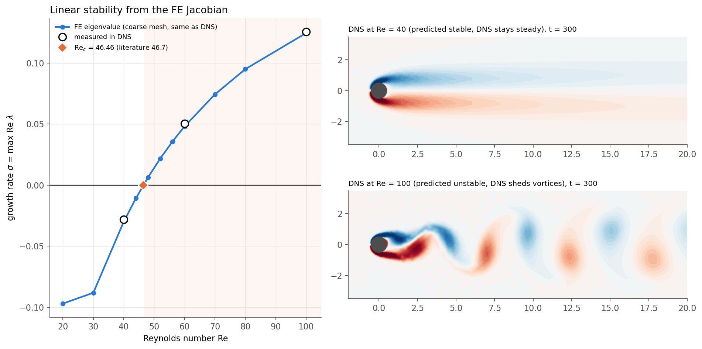

# Linear stability from the finite-element functions: flow past a cylinder

Goal: use the functions of a FEniCS simulation (the residual form `F`, its Jacobian, the mass form, the boundary
conditions) to decide whether a steady state is **stable or unstable** to small perturbations, and check on the
2D flow past a cylinder that the method finds the known instability (Hopf bifurcation to vortex shedding at
Re_c ≈ 46.7, frequency ω_c ≈ 0.74, Strouhal ≈ 0.117).

## Results at a glance

| quantity | this method | reference |
|---|---|---|
| critical Reynolds number Re_c | 46.46 (coarse) / 46.35 (medium) / 46.32 (fine) | 46.7 (Giannetti & Luchini 2007), 46.8 (Sipp & Lebedev 2007), 46.2 (Jackson 1987) |
| frequency at Re_c, ω_c | 0.7456 (coarse) / 0.7458 (medium) / 0.7458 (fine) | 0.736 – 0.74 |
| growth rate σ / frequency ω, Re = 40 | eigenvalue −0.0299 + 0.7336 i | DNS: −0.0281 + 0.7338 i (decays → steady) |
| growth rate σ / frequency ω, Re = 60 | eigenvalue +0.0481 + 0.7573 i | DNS: +0.0502 + 0.7572 i (grows → shedding) |
| growth rate σ / frequency ω, Re = 100 | eigenvalue +0.1245 + 0.7378 i | DNS: +0.1255 + 0.7392 i (grows → shedding) |
| saturated vortex shedding at Re = 100 (DNS): St, C_L amplitude, mean C_D | 0.165, 0.33, 1.34 | 0.164 – 0.167, ≈ 0.33, 1.33 – 1.35 |
| base flow: C_D, L_r/D at Re = 20 | 2.07, 0.92 | 2.00 – 2.06, 0.91 – 0.94 |
| base flow: C_D, L_r/D at Re = 40 | 1.54, 2.26 | 1.50 – 1.54, 2.24 – 2.35 |
| DFG benchmark 2D-1 (steady solver): C_D, C_L, Δp | 5.5782, 0.01061, 2.9368 | 5.5795, 0.01062, 2.9380 |

The DNS column is an independent check: a time-dependent Navier–Stokes simulation on the same mesh is started from the
steady state plus a small kick, and the growth/decay rate and frequency of the perturbation are measured from the
signal. They agree with the eigenvalue to within a few percent (growth rate) and 0.2 % (frequency).

## The method gives the verdict directly — no time simulation

The answer "stable or unstable" comes from **one steady solve plus one eigenvalue solve** on the domain with the
cylinder cut out: the sign of max Re λ. No time integration is involved:

    python3 check_stability.py cylinder $MESH_PATH solution/verdict --Re 60
    Re = 60: leading eigenvalue lambda = +0.04806 +0.75730 i  ->  UNSTABLE
       perturbations grow like exp(0.0481 t): amplitude x10 every 47.9 time units, oscillating with Strouhal number 0.1205
       time: steady state 11 s + eigenvalues 140 s, no time integration

The time-dependent simulations (DNS) in this folder are **not part of the method**: they are only an independent
check that the verdict, the growth rate and the frequency predicted by the eigenvalue are what really happens.

Note on the base-flow pictures: the steady solution w* is a solution of F(w*) = 0 at *every* Re, symmetric and
steady, also when it is unstable (like a pencil balanced on its tip). It is the state whose stability is tested,
not what one would observe. Whether it survives is decided by the eigenmode next to it
(`figures/base_flow_and_eigenmode.png`); what is actually observed above Re_c is the vortex street of
`figures/dns_vorticity.png`.

## How the method works

**1. Write the problem as "mass × time derivative + steady residual = 0".**
The time-dependent problem in weak form is

    m(∂w/∂t, ŵ) + F(w; ŵ) = 0      for all test functions ŵ,

where `F` is exactly the residual of the steady problem that is handed to the Newton solver
(`variational_problem_bc_*_steady.py`), and `m` is the mass form. For Navier–Stokes, `w = (u, p)` and only the
velocity has a time derivative: `m = ∫ u·û dx` (the pressure has none — it is a Lagrange multiplier that enforces
div u = 0).

**2. Steady state.** `F(w*; ŵ) = 0` is solved with Newton's method, continuing in Re from the previous solution
(`steady_state.py`).

**3. Linearize around the steady state (perturbation theory).** Insert `w = w* + ε w' e^{λt}` and keep the terms of
order ε. Because `F(w*) = 0`, what is left is

    λ m(w', ŵ) = − F'(w*)[w'; ŵ],

where `F'(w*)` is the Jacobian of the residual — *the same matrix Newton's method already assembles*
(`derivative(F, up, trial)` in FEniCS). In matrix form this is the generalized eigenvalue problem

    A x = λ B x,      A = −J(w*),   B = mass matrix (zero in the pressure block).

`w'(x) e^{λt}` is a perturbation that grows or decays with rate **σ = Re λ** and oscillates with frequency
**ω = Im λ**. The steady state is **stable if all eigenvalues have Re λ < 0** and **unstable as soon as one has
Re λ > 0**. This is implemented generically in `linear_stability.py::assemble_eigenproblem(F, w, bcs_hom, mass)`:
nothing in it is specific to Navier–Stokes, so the same function can be applied to the membrane problems
(see "Using it for other problems" below).

**4. Incompressibility is built in.** Because `B` has zero pressure rows, the pressure rows of the eigenproblem read
`D u' = 0`: every eigenvector is divergence-free. This is exactly equivalent to applying the Leray
(Helmholtz–Hodge) projector `P` to the linearized operator, which was the idea behind the earlier `P L` approach.
`check_projector_equivalence.py` shows that the two formulations give the same eigenvalues to 1e-13, provided `P` is
the correct discrete projector `P = I − M⁻¹G (D M⁻¹G)⁻¹ D`. The mixed formulation is preferable because it stays
sparse (no dense inverse is ever formed).

**5. Boundary conditions.** Perturbations satisfy the homogeneous version of the Dirichlet conditions
(`bcs_hom` in each variational problem module). They are imposed by an identity row in `A` and a zero row in `B`; these
rows give infinite eigenvalues, which the shift-and-invert transformation below maps to 0, so they never appear.

**6. Finding the relevant eigenvalue (shift-and-invert with complex shifts).** Only the few eigenvalues with the
largest real part matter, among ~10⁵. With shift-and-invert, `(A − sB)⁻¹B x = μ x` with `μ = 1/(λ − s)`, the eigenvalues
closest to the shift `s` become the largest `μ`, which a Krylov method (ARPACK) finds quickly. Two things matter
here:
* the instability of the cylinder wake is a **Hopf bifurcation**: the critical eigenvalue is a complex pair
  `λ ≈ 0 ± 0.75 i`, not a real one;
* the discretized wake has a **dense cluster of damped eigenvalues** with Re λ ≈ −0.08 … −0.15 close to the
  origin (`figures/spectra.png`). A real shift (s = 0), which is all a real-valued PETSc build allows, only returns
  those: at Re = 50 the 60 eigenvalues closest to 0 did *not* include the unstable pair.

So the shift is complex, placed slightly in the unstable half-plane: `s = 0.1 + 0.3 k i`, k = 0 … 5, which covers
0 ≤ ω ≤ 1.65 (`linear_stability.py::leading_eigenvalues`). Since PETSc here uses real numbers, the complex system
`(A − sB) z = y` is solved through its equivalent real 2n × 2n form, factorized once with MUMPS.
Eigenvalues come in conjugate pairs, so only Im λ ≥ 0 is scanned.

**7. Critical Reynolds number.** σ(Re) = max Re λ is computed on a list of Re; between the last stable and the first
unstable Re, secant iterations on σ(Re) = 0 (tracking the leading eigenvalue with one shift next to it) give Re_c and
ω_c (`stability_analysis.py`).

## Why it did not work before

1. **The Reynolds number never changed.** `variational_problem_bc_square_steady.py` read `Re` from `rarg.args` *when
   the module was imported*. `importlib.import_module` returns the already imported (cached) module, so setting
   `rarg.args.Re = R` inside the sweep loop had no effect: every point of the λ-vs-R plots used the *same* base flow
   (the first one). Now `R` is a `Constant` and `steady_state.newton_solve` does `vp.R.assign(Re)`.
2. **No incompressibility in `2D_eigenvalues_L.py`.** The operator acted on the velocity alone, without the pressure
   and without projection, so its eigenvectors are not divergence-free and its eigenvalues are those of a different
   operator. The term −(u'·∇)u* on unconstrained fields produces spurious, strongly positive eigenvalues that grow with
   R (`lambda_max_vs_R_L_operator.png`: λ_max ≈ 600 at R = 10, where the flow is certainly stable). In addition the
   problem was declared `GHEP` (Hermitian), but the linearized Navier–Stokes operator is not symmetric, so SLEPc was
   told the wrong structure and could only return real eigenvalues — while the instability is a complex pair.
3. **The projector in `stability_analysis.py` / `stability_analysis_test.py` was not a projector.**
   `P_old = I − G (DG)⁻¹ D` with `DG` the P1 Laplacian differs from the discrete Leray projector in two ways: the
   Laplacian is not the discrete Schur complement `D M⁻¹ G`, and the mass matrix inverse `M⁻¹` is missing. Result
   (`check_projector_equivalence.py`, on the old `square` mesh at Re = 50): `‖P_old² − P_old‖ = 6e−4` (should be 0),
   and `|D P_old x| / |D x| = 1.0`, i.e. it does not remove *any* divergence; the leading eigenvalue came out as −1.74
   instead of −3.98 (`solution/checks/check_projector_equivalence.png`). The inverse `(DG)⁻¹` was also built densely,
   column by column, which costs O(n_p²) and does not scale to useful meshes.
4. **Sign of the diffusion in `stability_analysis_test_test.py`.** The bilinear form had `+inner(grad(du), grad(v))`,
   i.e. anti-diffusion, where the linearized operator has `−inner(grad(du), grad(v))`; with this sign every mode
   is artificially destabilized (and again no incompressibility).
5. **The relevant eigenvalue was never targeted.** `LARGEST_REAL` without a suitable spectral transformation, or a
   real shift, does not find a complex pair hidden behind a dense cluster of damped modes (point 6 above).
   An eigenvalue of exactly 1.0 for every R (`largest_eigenvalue_vs_Re.png`) is not physical; a constant value
   like that typically comes from Dirichlet rows that end up as identity rows in both matrices.
6. **Geometry and mesh.** The `square` domain is 1 × 1 with a cylinder of radius 0.25: 50 % blockage and the outflow
   only 0.25 diameters behind the cylinder, discretized with 224 triangles. The wake, where the instability lives
   (the eigenmode extends over 5–25 diameters downstream, `figures/base_flow_and_eigenmode.png`), is cut off by the
   outflow boundary, and there is no reference value to validate against. The new `cylinder` problem uses a domain
   [−20, 40] × [−20, 20] refined around the cylinder and in the wake, where the answer is known.
7. **The time-dependent check diverged.** `../dynamics/velocity_error_vs_Re.png` shows a deviation from the steady
   state growing to 1e32, even at Re = 0.01 where every perturbation must decay: the time stepping itself was
   unstable, so it could not confirm or refute anything. `solve_dynamics.py` is a new time-dependent solver on the
   same mesh, spaces and BCs as the stability analysis (BDF2, semi-implicit convection). The old `dynamics` code was
   not modified.

## Verification, step by step

| step | what is checked | script | result |
|---|---|---|---|
| 1 | eigen-solver on problems with exact eigenvalues (heat equation; complex pairs from a rotation coupling) | `check_eigensolver.py` | rel. error 7e−6, PASSED |
| 2 | mixed (u, p) problem = Leray-projected operator; old projector is not | `check_projector_equivalence.py` | 1e−13, PASSED |
| 3 | steady Navier–Stokes solver on the DFG benchmark 2D-1 | `check_dfg_benchmark.py` | C_D error 2.4e−4, PASSED |
| 4 | base flow of the cylinder: drag and recirculation length vs literature | `stability_analysis.py` | `figures/base_flow_validation.png` |
| 5 | eigen-residual `‖Ax − λBx‖/‖λBx‖` of every leading eigenpair | `stability_analysis.py` | ~1e−14, `figures/convergence_and_residuals.png` |
| 6 | Re_c and ω_c on three meshes vs literature | `stability_analysis.py` | `figures/convergence_and_residuals.png` |
| 7 | independent DNS at Re = 40, 60, 100: growth rate and frequency vs eigenvalue | `solve_dynamics.py` | `figures/dns_vs_eigenvalues.png`, `figures/eigenvalues_vs_dns.png` |

## Figures (`figures/`)

* `summary.png` — σ(Re) from the eigenvalues with the DNS measurements, and the DNS below/above Re_c.
* `growth_rate_vs_Re.png` — growth rate σ and frequency ω of the leading eigenvalue vs Re, all meshes, with Re_c.
* `eigenvalue_trajectories.png` — the least stable eigenvalues in the complex plane for Re = 20…80: the leading pair
  moves right and crosses the imaginary axis.
* `mode_branches_vs_Re.png` — which mode leads: the oscillatory global mode overtakes the leading real mode at
  Re ≈ 30 and becomes unstable at Re_c; its Strouhal number.
* `spectra.png` — the eigenvalues found near the scan shifts at several Re.
* `stability_map.png` — stable/unstable ranges predicted on each mesh vs literature vs what the DNS did.
* `eigenvalues_vs_dns.png`, `dns_vs_eigenvalues.png` — eigenvalue prediction vs DNS measurement.
* `base_flow_and_eigenmode.png` — steady base flows (vorticity, recirculation bubble) and the leading eigenmodes.
* `base_flow_validation.png` — drag and recirculation length of the base flow vs literature.
* `convergence_and_residuals.png` — mesh convergence of Re_c and ω_c, eigen-residuals.
* `dns_vorticity.png`, `dns_lift.png` — the simulations: steady wake at Re = 40, vortex shedding at Re = 60 and 100.
* `dns_Re40_vorticity.gif`, `dns_Re60_vorticity.gif`, `dns_Re100_vorticity.gif` — evolution of the flow from the steady
  state plus a small kick (t = 0 … 300). Top: vorticity. Bottom: perturbation of the vorticity (rescaled in every frame,
  its amplitude is printed): it has the shape of the eigenmode, decays at Re = 40 and grows into the vortex street at
  Re = 60 and 100.
* `mesh_coarse.png` — the mesh.
* `../solution/checks/*.png` — plots of the verification checks.

ParaView files: `solution/cylinder_*/base_flow_*.xdmf`, `eigenmode_{real,imag}_*.xdmf`.

## Running it

Inside the FEniCS container (repository mounted at `/home/fenics/shared`), from this folder:

    export PYTHONPATH=/home/fenics/shared/modules:.
    python3 stability_analysis.py cylinder /home/fenics/shared/generate_mesh/2d/cylinder/solution_unbounded_coarse solution/cylinder_coarse --Re 20,30,40,44,48,52,56,60,70,80
    python3 solve_dynamics.py cylinder /home/fenics/shared/generate_mesh/2d/cylinder/solution_unbounded_coarse solution/dns_Re60 --Re 60 --T 300 --dt 0.1
    python3 plot_results.py solution figures

`run_all.sh` runs everything (meshes, checks, sweeps on three meshes, DNS, figures). Meshes are generated with
`generate_mesh/2d/cylinder/generate_cylinder_mesh.py`. Timing on 4 cores: the coarse-mesh sweep takes ~30 min, a DNS
~1 h.

## Using it for other problems (e.g. the membrane)

A steady problem module needs to export four things, which is all `linear_stability.py` uses:

* `F` — the steady residual form (what Newton solves), in terms of a `Function` `up` on a (mixed) space `W`;
* `up` — the `Function` that holds the steady state;
* `bcs_hom` — the homogeneous Dirichlet conditions that the perturbations satisfy;
* `mass(trial, test)` — the mass form: the terms that multiply the time derivatives in the time-dependent problem
  (only the fields that actually have a time derivative; constraints/Lagrange multipliers get no mass term).

Then

    A, B = linear_stability.assemble_eigenproblem(vp.F, vp.up, vp.bcs_hom, vp.mass)
    pairs = linear_stability.leading_eigenvalues(A, B, shifts=..., nev=8)
    stable = pairs[0].eigenvalue.real < 0

The shifts should cover the range of frequencies of interest (for a problem without oscillatory instabilities, real
shifts are enough). `R` should be a `Constant` in the module so that a parameter sweep really changes the steady state.
