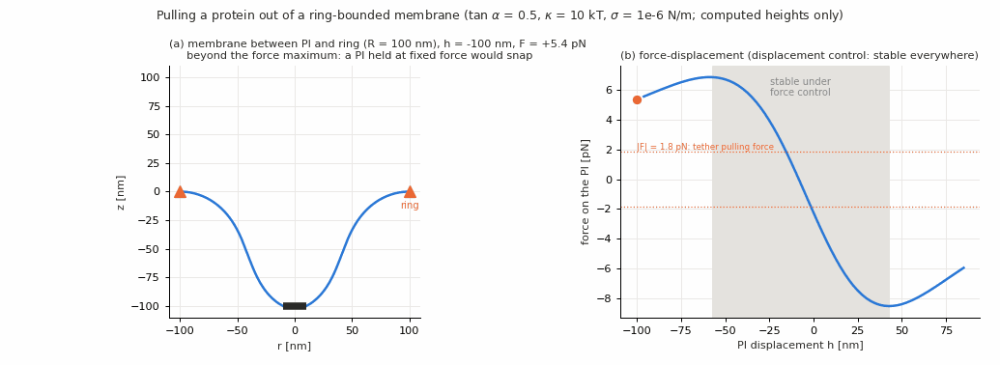
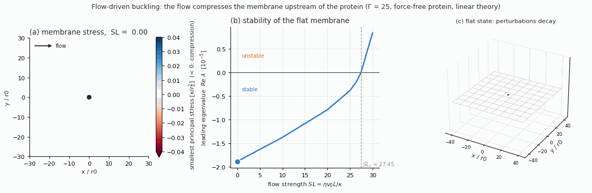
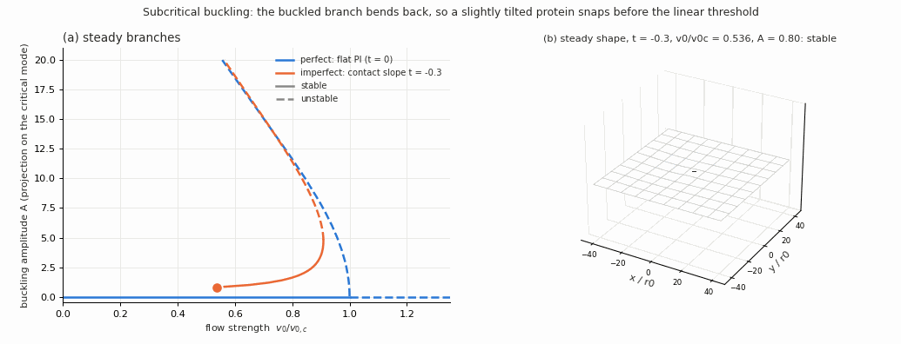
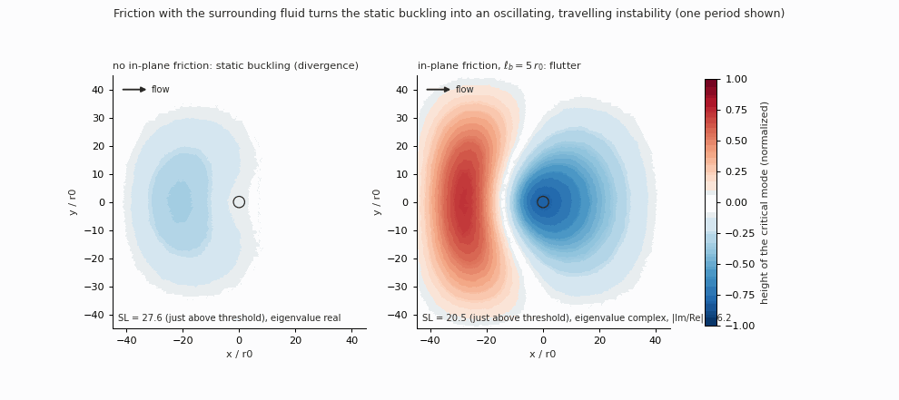

# What the results mean — an interpretation of the membrane stability study

This file explains what was computed, what the results say physically, how much they can be trusted, and what they
imply for the paper. Numbers and tables are in `README.md`; the plan is in `PAPER_PLAN.md`. Animations are in
`figures/gifs/` (made by `make_gifs.py`).

Units, unless stated: lengths in r0 (protein radius), energies in κ, forces in κ/r0, velocities in κ/(η r0).
Physical conversions use r0 = 10 nm, κ = 10 kT, σ0 = 1e-6 N/m (force unit κ/r0 = 4.1 pN), and for the flow the PRE's
L = 1 µm, η = 1e-8 Pa m s (velocity unit v* = κ/(ηL) = 4.1 µm/s).

---

## Take-home messages

1. **A protein pulled out of a membrane is always stable if its height is imposed, and snaps if its force is
   imposed.** The snap starts at the maximum of the force–displacement curve. There is no hidden non-axisymmetric
   instability, up to a contact angle of tan α = 2.
2. **The force maxima are large compared with a tether force for small rings.** They are 22 / 15 pN for R = 50 nm and
   8.5 / 6.8 pN for R = 100 nm, against 1.8 pN for a tether. For R = 1 µm the force stays below 1 pN over the computed
   range.
3. **Flow past a protein buckles the membrane.** The protein acts as an obstacle, and the tension drops upstream until
   the membrane is compressed there; it then buckles like an Euler column. With a physically correct protein this
   happens at SL_c ≈ 27.4, not at 16 as IRENE's setup gives.
4. **The threshold is not a property of the protein alone.** It grows logarithmically with the domain size and depends
   strongly on how the outer edge is held. A local friction with the surrounding fluid lowers it but does not remove
   the size dependence.
5. **The buckling is subcritical.** Near the threshold there is no gently buckled state. A protein with a small contact
   angle deforms smoothly up to a fold, about 9 % below the threshold for t = −0.3, and then snaps. This gives
   hysteresis, and the fold follows Koiter's |t|^(2/3) law.
6. **With friction, the buckling can become an oscillation.** For ℓ_b = 5–10 r0 the non-conservative force of the flow
   turns the static buckling into flutter, a wave emitted at the protein that travels upstream. This is the most direct
   bridge to pattern formation (section 6).

---

## 1. What was done, and why it can be trusted

**Method.** Every steady state that IRENE computes is linearized with the exact Jacobian of IRENE's own finite-element
residual, and the generalized eigenvalue problem J x = λ M x is solved with SLEPc (shift-invert, MUMPS). The mass form
M is read off IRENE's time-dependent equations. A positive real part of λ means the state is unstable, and the
eigenvector shows how it deforms.

**Verification (independent checks, all passed):**

| check | result |
|---|---|
| cylinder wake (the generic tool) | Re_c = 46.3 vs the literature value ≈ 46.7; direct simulation agrees |
| flat membrane on an annulus (exact Bessel solution) | 20 eigenvalues correct to 2e-4 |
| membrane at rest in the flow code (inertial and overdamped) | 1.5 % and 1e-9 |
| nonlinear time stepping of IRENE's equations (BDF2) against eigenvalues | 1.3e-4 |
| force on the protein against exact solutions (linear theory, catenoid) | converges to 1e-5 … 1e-4 |
| flow threshold on 3 meshes | 27.504 / 27.465 / 27.449 (converged to about 5e-4) |
| independent compressed-plate model against the full equations | 0.1–0.4 % in every geometry |
| adjoint sensitivity against a direct computation | 2e-7 |

**Three places where IRENE's formulation had to be changed** (to discuss with M. Castellana, see section 7):

- the tangential boundary conditions of the flow;
- the vertical force balance on the protein in the PRE's setup (square_b);
- the line-force integral used for the force on the protein.

None of them affects IRENE's steady solutions in the cases the PRE shows. Each one does affect stability, forces or
thresholds.

---

## 2. Protein pulled in a ring-bounded membrane (no flow)

**What was found:**

- **Displacement control.** Along every force–displacement branch all eigenvalues stay negative: R = 5, 10, 30 r0
  (plus R = 100 r0) and tan α = 0 … 2. The least stable mode is the axisymmetric one (m = 0). Only near the end of the
  branches for R = 5, tan α ≥ 1.5, the tilt mode (m = 1) takes over, and it stays stable. The spectrum softens as |h|
  grows: the membrane gets easier to deform, but never unstable.
- **Force control.** Stability is lost exactly where dF/dh changes sign, i.e. at the force extrema (Schur complement
  argument). Beyond the maximum, a protein held at a fixed force has no nearby equilibrium.

**Interpretation:**

- The ring problem is a **gradient flow of the Helfrich energy**. Stability is therefore a question about the energy
  landscape, and the friction only sets the time scale.
- With the height imposed, the energy is convex in all shape perturbations. The loss of stability under force control
  is the familiar instability of a softening spring under a dead load, not a new shape instability.
- Physically, the force maximum is the **barrier of tether extrusion**. A protein pulled with a constant force larger
  than the maximum would not stop at a moderately deformed state; it would pull out a tube. The Monge description
  cannot follow the tube itself, because tubes have overhangs.
- **Size dependence.** Small rings (R = 50–100 nm) confine the deformation, and the barrier is well above the
  asymptotic tether force 2π√(2κσ) = 1.8 pN. For large rings (R ≥ 300 nm) the maximum moves beyond the computed range
  (|h| > 10–20 r0) and the forces are below the tether force. This is consistent with the picture that the force
  overshoot of tether nucleation is set by the size of the region the protein deforms.
- **Contact angle.** A protein that imposes a slope sits below the ring (zero-force height down to −2.7 r0 at tan α = 2). It snaps
  upward earlier and downward later: the tilt biases the direction of tube formation.

**Caveat.** The force must be computed by virtual work, F = −dE/dh. The line-force integral used for Fig. 5 of the PRE
does not converge with the mesh, and it misses a moment term; its extrema are at different heights. The paper's force
curves should use F = −dE/dh (or a corrected line force) — to agree with the IRENE authors.

---

## 3. Flow past a protein: the buckling instability

### 3.1 The protein condition matters: SL_c ≈ 27.4, not 16

In IRENE's square_b setup the protein height is free, but nothing forces the net vertical force on the protein to be
zero. The rim equations keep a boundary term of the bending flux instead of a force balance.

- In the unstable mode the protein therefore feels a spurious vertical force, and the work of that force is exactly
  the extra term that lowers the threshold (ratio 0.995).
- With a physical protein (rigid and force-free, or clamped) the threshold is SL_c = 27.45 (force-free) / 27.66
  (clamped), mesh-converged. Two completely different formulations agree on it: the full IRENE equations and a reduced
  plate model.
- **Consequence for the PRE:** the flow-induced deformations shown there (t = −0.3, Fig. 11B) are computed with the same
  condition. They are probably too large at a given velocity.

### 3.2 Mechanism: the flow compresses the membrane upstream

- The membrane flows around the protein, which is a fixed, no-slip obstacle. The drag on the protein has to be
  balanced by a tension gradient in the membrane, so the tension **drops upstream**.
- At the threshold, most of the membrane upstream of the protein is under compression. In GIF 1 the red region is where
  the smallest principal stress is negative, and the critical mode is a dome centred about 20 r0 **upstream** of the
  protein, not on it.
- For a flat base state the problem reduces exactly to a plate under the flow-induced stress:
  ζ ∂t z = −κΔ²z + ∇·(T∇z), with T = σ0 I + v0 T1.
  - The instability is **Euler buckling of the compressed region**.
  - Bending and the base tension resist it; the flow-induced tension drop (80–90 % of the destabilizing energy) and the
    viscous stress drive it.
- It exists without inertia (the membrane Reynolds number is about 1e-9): this is a purely viscous, drag-driven
  instability.

### 3.3 The threshold depends on the geometry

| change | SL_c |
|---|---|
| reference (L = 100 r0, Γ = 25, all edges held) | 27.5 |
| L/r0 = 50 → 200 | 22.8 → 32.4 (+4.8 per doubling) |
| width 50 → 200 | 21.9 → 31.4 |
| only the inflow edge held | 12.1 |

- **Why.** In 2D Stokes flow the drag on an obstacle and the pressure (here, the tension) field it creates depend
  logarithmically on the system size (Stokes paradox). The compressed region, and the length over which it can buckle,
  are set by the box.
- **Friction does not provide a cut-off.** The friction with the surrounding fluid (Brinkman, screening length ℓ_b)
  screens the velocity disturbance, but not the tension disturbance, which still satisfies a Laplace equation.
  Meanwhile friction increases the drag, so it *lowers* the threshold (0.275 → 0.118 for ℓ_b = ∞ → 2) and the size
  dependence remains.
- **What this means for the paper.** A number like "SL_c = 27" is only meaningful together with its geometry. The
  intrinsic statement is the mechanism and the scaling:
  - SL_c ≈ a + b ln(L/r0) at fixed Γ;
  - a strong dependence on the far-field boundary.
  A geometry-independent threshold needs a physically motivated outer problem: a periodic array of proteins, a real
  channel, or coupling to the 3D bulk fluid (Saffman–Delbrück) — see section 5.
- **Physical scale.** In the PRE's units, v_c ≈ 27 v* ≈ 110 µm/s for L = 1 µm. That is well above the membrane flows
  usually reported in cells, which are sub-µm/s. The instability is therefore relevant for strong imposed flows (flow
  chambers, micropipettes, tube pulling), lower bending rigidity or softer tension, or larger domains — not for gentle
  cellular flows past a single protein. This estimate is itself geometry dependent (above).

### 3.4 Subcritical: the membrane snaps

- **Perfect protein (t = 0).** The buckled branch bends back to lower velocities, v0/v0_c = 1 − 0.0018 A², and is
  unstable (a barrier between the flat state and a far-away state). As soon as v0_c is crossed, the membrane does not
  settle into a small buckle; it jumps.
- **Protein with a contact angle (t ≠ 0, the PRE's case).** The flat state is replaced by a smoothly deforming one. It
  meets the unstable branch at a fold, below v0_c:

  | \|t\| | 0.01 | 0.03 | 0.1 | 0.3 |
  |---|---|---|---|---|
  | fold shift 1 − v_fold/v0_c | 1.1 % | 2.2 % | 4.8 % | 9.2 % |

  The shifts follow Koiter's law of imperfection sensitivity, (1 − v_fold/v0_c) ∝ |t|^(2/3) (fitted exponent 0.63).
- **Interpretation:**
  - Real proteins, which always impose some slope, see a **lower effective threshold** than the ideal linear one, and
    a **hysteresis loop**: once snapped, the membrane stays deformed while the flow is reduced below the fold.
  - The smooth "flow-induced deformation above v*" of the PRE is only the part of the branch before the fold.
  - Where the membrane goes after the snap is not known yet: the Monge description ends at large amplitude, and the
    time stepping from the fold has not been run.

### 3.5 With friction: flutter, a wave travelling upstream

- **Without in-plane friction** the stress field is divergence-free, the reduced problem is self-adjoint, and the
  instability can only be static buckling (a real eigenvalue).
- **With friction** ∇·T ≠ 0, and the term (∇·T)·∇z acts like a follower load: its direction follows the deformation,
  like the force on a garden hose or on a column loaded by a jet. The problem is no longer self-adjoint, and eigenvalues
  can be complex.
- **Result.** For ℓ_b = 5–10 r0 the first instability is a **Hopf (flutter)** bifurcation, with Im λ ≈ 1e-5 and
  |Im/Re| ≈ 6 just above threshold. The mode is emitted at the protein and travels **upstream** (from x ≈ 0 to x ≈ −26
  in half a period, GIF 3).
  - For ℓ_b = 2 and 20 the first instability is again a divergence.
  - The boundary between the two, a codimension-two point, has not been mapped yet.
- **Interpretation.** This is the only time-dependent state found so far: a protein in a flowing, frictional membrane
  can act as a **source of travelling undulations**. It is the natural starting point for pattern formation.

### 3.6 Where to push to change the threshold (adjoint sensitivity)

- The adjoint mode equals the direct one (self-adjoint case), and the wavemaker is the upstream dome.
- A steady in-plane force changes the threshold most in a band 5–15 r0 upstream of the protein, across the channel:
  - pushing **with** the flow there relieves the compression and raises the threshold;
  - pushing **against** it lowers the threshold.
- Physically, obstacles, pinning points or other proteins placed just upstream control whether the membrane buckles
  much more than the same objects elsewhere.

### 3.7 IRENE's example setup (inertial, slip penalty)

- With inertia (ρ = 1) there is also the classic pipe-conveying-fluid mechanism: two bending waves collide and diverge.
  It plays no role for real membranes (Re ~ 1e-9).
- Its threshold depends on IRENE's slip penalty, so it is not quantitative. It would need a Nitsche slip condition,
  only if that case is wanted.
- The weak oscillatory growth seen at small flow is a discretization artefact (∝ h³).

---

## 4. What is solid, and what is not yet

**Solid (converged, independently checked):**

- the ring stability statements;
- the flow thresholds for a given geometry;
- the buckling mechanism;
- the subcritical character and the Koiter scaling;
- the adjoint sensitivity;
- the existence of flutter with friction.

**Model-dependent:**

- the absolute flow threshold (geometry, outer boundary, choice of friction model);
- the physical velocities (depend on L, κ, η, σ0).

**Not yet known:**

- the state after the snap (flow) and after the force maximum (ring): both need a description beyond the Monge gauge,
  or time stepping;
- the nonlinear, force-free protein with a contact angle (the nonlinear rim force balance is not implemented; the
  imperfect branches use a clamped protein);
- the divergence/flutter map and its codimension-two point.

---

## 5. What to investigate next (prioritized)

1. **Settle the formulation with M. Castellana** (it blocks the paper):
   - the protein's vertical force balance in square_b;
   - the tangential flow boundary conditions;
   - the force definition (virtual work vs line force).
2. **Remove the box dependence.** The most useful single step: a **periodic cell with one protein** (periodic in x and
   y, flow driven by a uniform body force or pressure drop).
   - It gives a threshold per protein density (area fraction) instead of per box.
   - It is also the first step of the pattern-formation programme (Bloch–Floquet analysis, section 6).
   - Alternative: a membrane coupled to 3D bulk fluid on both sides, which is harder.
3. **Where does the membrane go after the snap?**
   - Time-step IRENE's equations (the BDF2 check already exists) from just beyond the fold (t = −0.3), and follow the
     amplitude until the Monge gauge breaks down.
   - This decides whether the post-snap state is a large steady dome, a periodic state, or a runaway (tube / fold).
4. **Weakly nonlinear theory.**
   - Compute the Landau coefficient from the direct and adjoint modes (the adjoint code exists), and check it against
     the continuation result −0.0018 A².
   - Derive the imperfection law analytically (the 2/3 exponent and its prefactor).
   - This gives the paper a closed-form bifurcation statement.
5. **Flutter map.** A scan in (ℓ_b, Γ) with the full equations to locate the divergence/flutter boundary, the frequency
   and the codimension-two point where both cross together (fold–Hopf, or Takens–Bogdanov if the pair is born at λ = 0). Near it, rich dynamics are expected.
6. **Nonlinear force-free protein** with a contact angle: implement the rim force balance for the nonlinear problem
   (the same fix as the line force). The PRE's case t = −0.3 can then be redone exactly.
7. **Ring beyond the maximum.**
   - An axisymmetric arc-length formulation (a small ODE code) to follow tube extrusion past the snap.
   - Compare the force overshoot with Derényi–Jülicher–Prost.
   - Extend R = 1 µm to larger h to reach its maximum.
8. **Physical mapping.** Tables of thresholds in µm/s and pN over realistic ranges (σ = 1e-6 … 1e-4 N/m,
   κ = 10–50 kT, L = 0.5–10 µm), so that the regime where the instabilities matter is explicit.
9. **Two proteins** (PAPER_PLAN §4): how the buckling modes of two obstacles interact (in phase vs out of phase). This
   is also a step toward arrays.

---

## 6. From here to pattern formation

So far every instability is a **single, localized mode** (a global mode attached to one obstacle in a finite box).
Patterns — stripes, lattices, travelling waves with a selected wavelength — need a **spatially extended base state**
whose instability picks a finite wavenumber. Several routes build on what exists:

**(a) Lattice of proteins → Bloch–Floquet stability.**
- A periodic array of proteins in a mean flow has a periodic base state. Its perturbations are Bloch waves
  z' = e^{iq·x} p(x), and the unit-cell eigenproblem gives a band structure λ(q).
- The most unstable q decides the pattern:
  - q = 0: all buckles in phase;
  - q at the zone edge: alternating buckles;
  - q along or across the flow: stripes of one orientation or the other.
- It needs periodic boundary conditions with a complex Bloch phase in the unit cell. The plate model makes this cheap:
  T1 on one cell, then a scan over q.
- This is the most concrete route, and it also fixes the box problem (step 2 above).

**(b) Wrinkling in a gradient of compression.**
- A membrane dragged over a frictional support (substrate, cortex) with speed v0 has a tension that decreases linearly
  along the flow, σ(x) = σ0 − b v0 x.
- Locally the dispersion relation is ζλ = −κk⁴ − σ(x)k² − i b v0 k_x (the last term is the follower load). Where σ < 0
  the most unstable wavelength is 2π√(2κ/|σ|): **wrinkles with a selected wavelength, drifting with a phase velocity**.
- In the protein problem the compressed region is small compared with this wavelength, which is why a single dome
  forms. Where the compressed region holds several wavelengths (larger domains, stronger compression, or lower κ),
  multi-lobed wrinkle patterns are expected.
- A cheap first test with the existing plate model: compute the first 10–20 modes at larger L and v0 > v0_c, and watch
  them turn from domes into wrinkle trains.

**(c) Convective vs absolute instability.**
- With a mean flow, an extended system can amplify noise that is carried away (convective) or oscillate by itself
  (absolute). The flutter found with friction is a candidate for a self-sustained oscillator.
- Local analysis: the dispersion relation of (b), with the Briggs–Bers saddle-point criterion.
- Global analysis: the eigenvalues already computed.
- This framework (Huerre–Monkewitz) says when a protein acts as a pacemaker emitting waves, and when the membrane only
  amplifies incoming noise.

**(d) Amplitude equations.**
- The adjoint and direct modes are the ingredients of a Ginzburg–Landau / Swift–Hohenberg reduction:
  - for a periodic array, a real GL equation for stationary patterns;
  - a complex GL equation near the flutter threshold (travelling waves, phase turbulence).
- Because the bifurcation is subcritical, extended systems may show **localized patterns** (homoclinic snaking):
  patches of buckled membrane in a flat background, which may be what "localized buckles" look like in experiments.

**(e) Mobile, curvature-coupled proteins.**
- Biologically the richest route: let the protein density φ be a field, advected by the membrane flow, diffusing, and
  coupled to curvature (proteins prefer curved regions and create curvature).
- This is the classic mechanism for curvature-induced phase separation and for active-membrane patterns (Leibler;
  Ramaswamy–Toner–Prost). The flow adds advection and a preferred direction, so travelling bands are expected.
- IRENE would need one extra conserved field: a larger development, but the stability tool carries over unchanged
  (Jacobian of the residual + eigenvalues).

**(f) Nonlinear dynamics.** Time stepping in large or periodic domains beyond the threshold: pattern saturation,
coarsening, and wave trains emitted by a protein. The BDF2 integrator exists and is verified.

**Suggested order:**
1. (b), a cheap plate-model test, same week;
2. (a), a periodic cell with Bloch waves, which also fixes the box;
3. (c)/(d), the theory that makes it a paper;
4. (e) as a follow-up project.

---

## 7. Points for M. Castellana

1. **square_b protein:** no vertical force balance on the rim, so a spurious force acts on the protein. The flow
   threshold goes from 27.4 to 16.2, and the PRE's flow deformations are affected.
2. **Tangential boundary conditions in the flow residual** (viscous traction subtracted on the walls, on the protein and
   at the outflow): the linearized dynamics has spurious growing modes at rest.
3. **Force on the protein:** the line-force integral (PRE Eqs. 17–18) misses the moment term and does not converge
   with the mesh; the virtual-work force converges to exact solutions. This decides the force extrema in Fig. 5.
4. **Scope and authorship** (PAPER_PLAN §0).

---

# Part II — third round

Topics: nonlinear theory, the post-snap state, the force-free PI, lattices of proteins, several proteins, tubes and
pattern formation.

**Take-home messages of Part II**

1. **The snap-through is understood in closed form.** A weakly nonlinear theory built from the direct and adjoint modes
   reproduces the continuation: 1 − v0/v0_c = 0.0018 A², and folds at 0.231 |t|^(2/3), with nothing fitted. Past the
   fold the membrane collapses into a deep pit upstream of the protein; there is no gentle buckled state.
2. **With the correct force balance, the PRE's smooth flow-induced deformation disappears.** A force-free protein with
   t = −0.3 stays nearly flat up to SL ≈ 23 and snaps at SL ≈ 25.3. IRENE's square_b deformations (above 10 r0 at
   SL ≈ 14) come from the spurious force on the protein.
3. **The box dependence is removed by a lattice of proteins.** The threshold becomes a function of protein density, is
   the same for any drive, and is a collective long-wave undulation of the whole lattice that travels upstream.
4. **A universal criterion.** Buckling sets in when the in-plane force on the anchored proteins reaches about κ/r0
   (about 4 pN). This holds for one protein, for 24 multi-protein arrangements (1.05–1.5 κ/r0) and for dilute
   lattices (→ 1.0 κ/r0).
5. **Friction gives flutter in a window of screening lengths** (ℓ_b ≈ 3–15 r0 at low tension, narrower at high
   tension); the map was checked 11 times against IRENE.
6. **Patterns:**
   - a sliding membrane wrinkles into static stripes parallel to the flow;
   - strongly driven boxes show multi-lobed wrinkle trains near the protein;
   - the lattice mode obeys a convective Cahn–Hilliard-type equation for the slope;
   - mobile curvature proteins form a modulated phase that the flow aligns into stripes along the flow.
7. **Tubes.** Beyond the force maximum a protein pulled from a ring extrudes a tube. The force overshoot (up to 27×
   the tether force) is set by the ring size and the tension; the plateau is the tether force.

Figures `figures/r3_*.png`, animations `figures/gifs/gif5–7`, data `results/round3/`, numbers
`results/round3_summary.json` and `results/round3/physical_tables.md`. Code in `plate/` (standalone flat-membrane
model: periodic cells, Bloch waves, several PIs), `axisymmetric/` (tubes) and `irene_addon/stability/flow/`
(flow_landau, flow_snap, flow_forcefree).

## 8. Weakly nonlinear theory: why the membrane snaps, in closed form

The weakly nonlinear (centre-manifold) reduction of IRENE's full equations at the threshold, built from the direct and
adjoint critical modes (`flow_landau.py`), gives the amplitude equation

    dA/dt = lambda_v (v0 - v0_c) A + N3 A^3 + H t,

with lambda_v = 3.31e-4, N3 = +1.65e-7 > 0 (subcritical) and H = -9.25e-5 (clamped PI, mesh A).

- **Perfect branch.** v0/v0_c = 1 - (N3 / lambda_v v0_c) A^2 = 1 - 0.0017966 A^2, against 0.00179 from the
  continuation. It holds up to A ≈ 8; beyond that the branch bends back more slowly.
- **Imperfection law (Koiter), with its prefactor:** 1 - v_fold/v0_c = 3 (N3/lambda_v v0_c) |H t / 2 N3|^(2/3)
  = 0.231 |t|^(2/3), with nothing fitted:

  | \|t\| | 0.01 | 0.03 | 0.1 | 0.3 |
  |---|---|---|---|---|
  | theory | 0.0107 | 0.0223 | 0.0497 | 0.103 |
  | continuation | 0.011 | 0.022 | 0.048 | 0.092 |

- **Where the subcriticality comes from.** 96 % of N3 is the direct cubic term of the equations (the geometric
  nonlinearity of a curved membrane under the flow stress). The readjustment of the in-plane flow and tension at
  second order (x2) contributes only 4 %. The membrane snaps because large slopes amplify the destabilizing
  compression faster than bending can resist, not because the flow rearranges.

## 9. Where the membrane goes after the snap

Time stepping of the full equations just above the fold (t = -0.3, clamped PI; `flow_snap.py`, `gif5`):

- **Phase 1:** a long, slow drift (the slowing down near the fold: about 5e5 time units at 0.92 v0_c, 1.4e5 at
  0.97 v0_c).
- **Phase 2:** an accelerating collapse. The dome turns into a **pit about 20 r0 deep** just upstream of the PI, and
  the pit moves towards it (its centre goes from x = -16 to x = -10 r0).
- **Phase 3:** the wall between the pit and the PI becomes nearly vertical (slope 15 at r ≈ 4 r0), and the Monge
  description z(x, y) breaks down.

There is no moderate, saturated buckled state: the unstable branch continues without turning back up to A = 21, where
the continuation also fails. The post-snap state is a large invagination with overhangs: a tube- or fold-like structure
that needs a parametrization beyond the Monge gauge. The clamped PI exaggerates the wall at the rim; a force-free PI
would be dragged down with the pit.

## 13. Several proteins

Plate model in the PRE box, Γ = 25, rigid force-free PIs (`study_multi.py`, `figures/r3_multi.png`):

| configuration | SL_c | total drag on the PIs at threshold [κ/r0] |
|---|---|---|
| single PI | 27.44 | 1.05 |
| pair along the flow, d = 3 / 10 / 30 | 25.2 / 22.9 / 16.5 | 1.11 / 1.22 / 1.10 |
| pair across the flow, d = 3 / 10 / 30 | 21.4 / 17.3 / 14.4 | 1.09 / 1.16 / 1.29 |
| 3 / 5 PIs across the flow, d = 10 | 12.5 / 7.1 | 1.24 / 1.43 |
| 3 / 5 PIs along the flow, d = 10 | 19.7 / 15.5 | 1.30 / 1.41 |
| random cluster of 8 (24 x 24 r0) | 11.3 | 1.49 |

- **More proteins buckle the membrane earlier**, by up to a factor 4 here. Proteins side by side (across the flow) are
  the most dangerous: they block more flow. Proteins in a file along the flow shield each other.
- **The total anchoring force sets the threshold.** Across all 24 configurations, the total drag at threshold stays
  within 1.05–1.5 κ/r0 (4–6 pN for κ = 10 kT, r0 = 10 nm), while SL_c varies by a factor 4. A useful rule: the patch
  buckles when the summed in-plane force on its anchored proteins reaches about κ/r0, almost whatever their arrangement.
- **The critical mode is always collective:** one dome upstream of the whole group, with all PIs moving in phase. For
  two PIs far apart along the flow the next mode is out of phase. Interactions between PIs therefore do not create
  patterns at the threshold; they lower it and make the buckled region larger.

## 14. Ring beyond the force maximum: tubes

Axisymmetric shape equations in arclength (`axisymmetric/ring_tube.py`). They reproduce IRENE's virtual-work force in
the Monge range to 2e-4, and they continue through overhangs (`figures/r3_tube.png`, `gif7`).

- **Large rings (R = 1 µm).** Past the force maximum the membrane forms a tube of radius √(κ/2σ) = 14 r0, and the
  force tends to the tether force 2π√(2κσ) = 0.444 κ/r0 = 1.84 pN (reached to 4 digits), with damped oscillations
  around it (peak 2.1 pN).
- **Small rings (R = 50–100 nm,** smaller than the tube radius 140 nm). The ring confines the membrane: no proper
  tube, a narrow neck instead, and a large overshoot (22 / 8.5 pN) before the force drops below the tether value.
- **Under force control** the PI is unstable beyond the maximum (dF/dh > 0 there): a constant pulling force above
  F_max extrudes a tube.
- **Hysteresis.** For f0 < F < F_max the short state is stable, but a tube that already exists keeps lengthening,
  because it only resists with f0 < F. To retract it the force must fall below f0: this is the hysteresis of tether
  extrusion, with the barrier F_max - f0 set by the ring size.

## 16e. Mobile, curvature-coupled proteins carried by the flow

Linear analysis of a flat membrane with a protein density φ (spontaneous curvature C0 per unit φ, osmotic stiffness
χ, gradient energy ε). φ is advected by the membrane flow U; the shape is not, since a tangential flow does not move
the surface (`plate/analysis_mobile.py`, `figures/r3_mobile.png`).

- **Without flow (Leibler / Andelman type).** The tension penalizes long, curved protein-rich domains (macroscopic
  demixing only for χ < -C0²). The first instability is a **modulated phase**:
  - χ_c = εσ - 2C0√(εσ), at wavelength 2π/k* with k*² = C0√(σ/ε) - σ;
  - for C0 = 0.2, ε = 1, σ = 0.0025: wavelength about 73 r0.
  The numerics reproduce the analytic χ_c to all digits.
- **With flow.** The relative drift between the advected proteins and the static shape detunes modulations along the
  flow. Their threshold moves to more negative χ (e.g. -0.0175 → -0.029 at U = 3e-3) and, at large U, all the way to
  macroscopic demixing, χ = -C0². Modulations across the flow are unaffected.
- **Result.** The first instability becomes **static stripes parallel to the flow** (wavevector perpendicular to U),
  from the smallest flow speeds on. Travelling bands (along the flow, moving at 30–40 % of U) appear only if transverse
  stripes are suppressed, e.g. in a channel narrower than 2π/k*. Flow therefore aligns curvature-induced protein
  domains into stripes along the flow direction.

## 10. The PRE's case redone: a force-free PI with a contact angle

The vertical force on the PI is computed from the conserved vertical stress flux of the membrane:
- the Noether current of the Helfrich energy, plus the vertical components of the tension and viscous stresses;
- integrated over an annulus around the PI, which avoids derivatives on the boundary
  (`modules/stability/vertical_force.py`).

**Validation:**
- in the ring problem it equals the virtual-work force −dE/dh to 5e-5;
- it changes by 1e-6 between cutoffs.

**Method.** The PI height h is then fixed by F(h, v0) = 0 at every flow speed. The branch is followed in v0, then in
h through the fold (`flow_forcefree.py`, `figures/r3_forcefree.png`).

| t | h at rest [r0] | fold v_fold/v0_c (force-free) | clamped PI (h = 0) |
|---|---|---|---|
| -0.03 | 0.089 | 0.9816 | 0.978 |
| -0.1 | 0.297 | 0.9586 | 0.952 |
| -0.3 | 0.862 | 0.919 | 0.908 |

- **Folds.** 1 − v_fold/v0_c = 0.018, 0.041, 0.081: exponent 0.64, Koiter's 2/3 again. The folds are slightly later
  than for the clamped PI.
- **The PRE's deformation is a different branch.**
  - With the force balance, at t = −0.3 the membrane stays close to its shape at rest (max|z| ≈ 1 r0: the PI sits
    0.86 r0 above the frame, and that changes little) up to SL ≈ 23.
  - It then deforms quickly and snaps at SL ≈ 25.3.
  - IRENE's square_b, where the PI carries a spurious vertical force, gives deformations above 10 r0 already at
    SL ≈ 14.
  - The large, smoothly growing flow-induced deformations of the PRE (Fig. 11B) are therefore the response to that
    spurious force, not a property of the flowing membrane.
- **Inversion.** Near the fold the PI is pulled down (h: +0.86 → +0.54 at t = −0.3; it changes sign for
  t = −0.1, −0.03), and the deformation turns into the pit seen after the snap.

## 11. Divergence or flutter: the map in friction and tension

Plate model in the PRE box, rigid force-free PI, friction b (v − v0 e_x) (`plate/study_flutter_map.py`,
`figures/r3_flutter_map.png`). The first crossing of the leading eigenvalue is classified as real (divergence) or as
a complex pair (flutter). 11 checks with IRENE's full equations agree to 0.3 % or better, including the type
(Γ = 0, 25, 100; ℓ_b = 2.5 … 14).

| Γ | flutter first for ℓ_b in | flutter frequency at threshold |
|---|---|---|
| 0 | ≈ 2.7 – 15 | 1e-5 → 3e-6 (decreasing with ℓ_b) |
| 10 | ≈ 2.7 – 15 | |
| 25 | ≈ 3.2 – 13 | 1.2e-5 → 2.6e-6 |
| 50 | ≈ 3.7 – 11 | |
| 100 | ≈ 4.2 – 7.5 | 1.6e-5 → 1e-5 |

**Interpretation:**
- **Strong friction (ℓ_b ≲ 3).** The flow disturbance is confined close to the PI and the compression is local: the
  instability is static buckling.
- **Weak friction (ℓ_b ≳ 15).** The follower force b(v − v0) is too weak to matter: static buckling again.
- **In between.** The follower load turns the first instability into an oscillation: a wave emitted at the PI and
  travelling upstream.
- **Tension.** It narrows the flutter window: it stabilizes the long, slowly drifting wave more than the static dome.
- **Codimension-two points.** The two ends of the window are where both types of instability occur together.

**Local analysis** (`plate/analysis_local.py`). With the local compression s and drift g = (∇·T)_x, the impulse
response is absolutely unstable for G = g√κ/s^1.5 < G* = 1.622 (saddle point, confirmed by the impulse response). In
the compressed region of the box G ≪ G* (the drift is weak): wherever a local description applies, the PI acts as a
self-sustained source of waves rather than a noise amplifier. At threshold, however, the local wavelength is
comparable to the compressed region, so the flutter is a global mode of the geometry.

## 12. Removing the box: a lattice of proteins (periodic cell, Bloch waves)

**Setup.** Anchored PIs on a square lattice (one PI per cell of side Lc, area fraction φ = π r0²/Lc²). The membrane
is driven past them by a uniform tangential force f0 (the shear stress of an outer flow) or by friction with an outer
fluid moving at V (`plate/study_lattice.py`, `plate/lattice_longwave.py`, `figures/r3_lattice.png`, `gif6`).

**Checks:**
- drag agrees with Sangani–Acrivos (square arrays of cylinders) to 3e-4;
- Bloch q = 0 reproduces the periodic problem exactly;
- λ(q + G) = λ(q) to 1e-3.

**Results (σ0 = 0.0025 κ/r0² = 1e-6 N/m):**

| cell Lc / r0 | φ | U_c [κ/(η r0)] | drag per PI at threshold [κ/r0] | K_eff / κ |
|---|---|---|---|---|
| 6 | 0.087 | 1.00 | 18.6 | 1.8 |
| 8 | 0.049 | 0.74 | 10.3 | 1.3 |
| 10 | 0.031 | 0.60 | 6.9 | 1.1 |
| 14 | 0.016 | 0.45 | 4.1 | 1.05 |
| 20 | 0.0079 | 0.35 | 2.5 | 1.03 |
| 28 | 0.0040 | 0.28 | 1.75 | 1.04 |
| 40 | 0.0020 | 0.25 | 1.30 | 1.08 |
| 56 | 0.0010 | 0.24 | 1.09 | 1.15 |
| 80 | 0.0005 | 0.24 | 1.00 | 1.3 |

(long-wave thresholds; Lc ≥ 40 from `lattice_longwave.py` only.)

- **Dilute limit.** U_c levels off at ≈ 0.24 κ/(η r0), and the drag per PI at threshold goes to 1.0 κ/r0: the same
  value as for a single PI in the PRE box (1.05 κ/r0) and the same range as for every multi-PI configuration
  (1.05–1.5). **A membrane with anchored proteins buckles when the in-plane force on each protein reaches about κ/r0**
  (about 4 pN for κ = 10 kT, r0 = 10 nm). Dense lattices need more force per protein, because neighbours share the
  compression.
- **Strong friction.** With ℓ_b = 5, very dilute lattices (Lc = 56, 80 ≫ ℓ_b) need a higher velocity again
  (U_c ≈ 0.6, 0.5): the friction screens the flow between distant proteins, so they stop acting collectively. With
  ℓ_b = 20 the values stay at the force-drive values up to Lc = 80.
- **Tension** matters only once the cell is larger than ℓ = √(κ/σ0). At Lc = 28: U_c = 0.26 / 0.29 / 0.57 for
  σ0 = 1e-7 / 1e-6 / 1e-5 N/m. At Lc = 8: 0.75 / 0.76 / 0.81.

- **The box dependence is gone.** The threshold is now a function of the protein density, a physical parameter
  (roughly U_c ∝ φ^0.4 in this range).
- **The drive does not matter.** Friction with ℓ_b = 5 or 20 gives the same U_c within about 2 %: the lattice
  threshold does not depend on how the membrane is driven.
- **The instability is collective and long-wave.** A rigid PI makes the uniform lift of the whole lattice neutral
  (λ = 0 at q = 0). For long waves along the flow, ζλ = −σ_eff q² − iζcq − K_eff q⁴. Here σ_eff is the effective
  tension of the lattice (base tension plus the bending of the cells between rigid PIs, ≈ 0.19 κ/r0² at half the
  threshold drive for Lc = 8), and the flow drives it to zero.
  - At the threshold the whole lattice undulates with a long wavelength (set by the system size or by the distance
    from the threshold).
  - The pattern travels upstream at c = (1.0–1.1) f0/ζ: the drift of the follower load.
  - No finite-q mode is unstable before it.
- **Amplitude equation.** For the mean height H of the lattice, by the up-down and translation symmetries,
  ζ H_t = σ_eff H_xx − K_eff H_xxxx − ζ c H_x + nonlinear terms (cubic in the slope); unstable once σ_eff < 0.
  - The slope u = H_x therefore obeys a *convective Cahn–Hilliard* equation (Golovin et al.). Its known behaviour is
    coarsening of slope domains (a terraced, sawtooth membrane), arrested or turned into travelling patterns by the
    drift.
  - The cubic coefficient is computed in Part III, section 18: destabilizing (collapse) for dilute lattices,
    saturating (terraces) for the densest lattice computed (φ ≈ 9 %).

## 15. Physical numbers (`results/round3/physical_tables.md`)

All values for r0 = 10 nm and η = 1e-8 Pa s m.

- **Single PI in a 1 µm patch.** At threshold the drag on the PI is 4.3 pN (κ = 10 kT, σ = 1e-6 N/m), 9.8 pN
  (1e-5 N/m) and 42 pN (1e-4 N/m); v_c ≈ 0.1–1 mm/s, and ten times more for η = 1e-9.
- **Lattice of anchored PIs** (κ = 10 kT, σ0 = 1e-6 N/m). U_c ≈ 100–400 µm/s for φ = 0.05 % – 9 %, with a drag per PI
  of 4–77 pN (about 4 pN in the dilute limit).
- **What this means.** These are large velocities for membrane flows in cells (usually reported below µm/s). The
  forces, however, are in the range of molecular motors, actin polymerization and tether pulling (pN). The instability
  is relevant wherever proteins are held against a fast membrane flow (micropipette aspiration, tube pulling, flow
  chambers, cytoskeleton-anchored proteins under strong cortical flows), or for membranes much softer than 10 kT.
- **Ring (tube extrusion).** F_max = 22–120 pN for R = 50 nm, 8–60 pN for R = 100 nm, 3–50 pN for R = 300 nm, with
  the tether force 2π√(2κσ) = 1.8–41 pN as the plateau. The overshoot F_max/f0 is large for small rings and soft
  tension (up to 27×), and tends to 1.2–1.4 for large rings.

---

# Part III — fourth round

Topics:
- the post-snap state with a force-free protein;
- the nonlinear coefficient of the lattice's long-wave equation;
- mobile curvature proteins in IRENE, carried by the flow around an anchored protein.

Figures `figures/r4_*.png`, data `results/round4/`, numbers `results/round4_summary.json`. Code:
- `irene_addon/stability/flow/flow_snap_ff.py`;
- `plate/nonlinear_cell.py`;
- `irene_addon/stability/flow_phi/` (IRENE with two extra fields φ and m).

Collection: `collect_round4.sh`; figures: `plot_round4.py`.

**Take-home messages of Part III**

1. **After the snap the protein rides up, and the membrane folds.** A force-free protein is not dragged into the pit.
   It is lifted to 7–8 r0 on the crest of the downstream dome, while the pit upstream deepens to −16.5 r0. The wall
   between them (24 r0 drop over 10 r0) turns vertical in the same time as with a clamped protein: the end state is
   an S-shaped fold, the onset of an overhang beyond the Monge description.
2. **The long-wave equation of a protein lattice is subcritical when the lattice is dilute, and saturating when it is
   dense.**
   - The homogenized cell gives J(u) = σ_eff u + g u³. At the threshold drive g < 0 for φ ≤ 5 %: the lattice
     collapses, like the single protein.
   - For φ ≈ 9 %, g > 0: slopes saturate at |u| ≈ 0.1, and the convective Cahn–Hilliard dynamics predicts terraces
     (a sawtooth membrane) that coarsen and drift upstream.
   - At rest the tilted lattice always softens (g/σ_eff ≈ −2 to −4). The stiffening of dense lattices comes from the
     strong flow.
3. **Flow suppresses curvature-protein demixing around an anchored protein, and aligns what is left.** In IRENE with
   mobile proteins the demixing threshold χ_c falls from −0.051 (at rest; −0.048 for the infinite membrane) to −0.12
   at SL = 5. From SL ≈ 10 on only an outflow boundary-layer mode is left, and none at all down to χ = −3.4 at
   SL = 20. The critical modes are stripes parallel to the
   flow at the outflow, as the plate theory predicted.
4. **Mobile proteins lower the buckling threshold only by about 9 %** (SL_c from 27.5 to about 25.0; stiff proteins,
   χ = 100, give back 27.45). This is much less than their equilibrium softening would give (22 at χ = 1, about 0 as
   χ → 0). At the buckling threshold the proteins are carried through the patch
   faster than they can relax into the mode.

## 17. After the snap with a force-free protein (`flow_snap_ff.py`, `figures/r4_post_snap_forcefree.png`)

**Setup.**
- IRENE's full equations, mesh A, contact slope t = −0.3.
- The PI is a rigid disc whose height h is an unknown fixed by zero net vertical force.
- The force is the conserved vertical stress flux through an annulus around the PI (section 10), with the
  normal-friction body force added in the time-dependent case. The force balance is solved at every BDF2 step by a
  secant iteration on h.
- **Phase 1:** a steady force-free branch up to 0.915 v0_c.
- **Phase 2:** time stepping at 0.93 and 0.97 v0_c, both beyond the fold (0.92 v0_c, section 10).

**Steady branch.** The PI rises with the flow from h = 0.86 (no flow) to 1.06 at 0.8 v0_c. It then sinks again to 0.70
at 0.915 v0_c, as the upstream dip grows (z_min = −3.2).

**Dynamics.** The sequence is the same as with the clamped PI of round 3:
- a long drift near the fold (6e5 time units at 0.93, 1.6e5 at 0.97 v0_c);
- an accelerating collapse into a pit upstream;
- a wall that turns vertical.

What changes is what the protein does:

- **The force-free protein is lifted, not dragged down.** h goes from 0.7 to 7.3 (0.93 v0_c) and 8.0 (0.97 v0_c).
  The PI rides on the crest of the downstream dome while the pit upstream deepens to z_min ≈ −16.5.
- **An S-shaped fold.** The membrane drops by about 24 r0 over about 10 r0 between the PI and the bottom of the pit.
  The steepest wall is 3–7 r0 upstream of the rim, and its slope passes 11–12 at the end of the runs.
- **Same time scale, shallower pit.** The pit is shallower than with the clamped PI (−16.5 vs −22 at the same stage)
  because the PI gives way upward. The time scale of the collapse is the same, and the slope diverges the same way
  (panel c). The clamped rim only exaggerated the depth; the force-free protein does not stop the collapse.
- **Accuracy of the force balance.** The vertical force should not depend on which annulus it is measured
  through. The spread between annuli stays below 0.02 κ/r0 up to slope 5 (h = 6.7) and 0.08 at slope 7 (h = 7.2). It
  grows to 0.4–0.9 κ/r0 at slopes 9–12, as the Monge description degrades. The lift of the PI is therefore a robust
  result: it is complete before the force balance loses accuracy.
- **The end state is beyond the Monge gauge.** At slope ≈ 12 the time step drops to about 10 and grid-scale
  ripples appear in the pit bottom (panel f): the last steps mark the onset of an overhang and are not converged.
  - The question "where does the membrane go" now has a sharper answer: a fold with the protein on top and a deep
    invagination upstream. Its continuation is an overhanging lip, i.e. the start of a tube or a membrane fold pulled
    into the flow.
  - This needs a parametric surface (X(s, θ, t) with an arbitrary Lagrangian–Eulerian gauge), which IRENE's geometry
    module does not yet provide for a moving boundary with flow. A planar elastica would need the tension field, which
    the flow sets, and on its own it draws in membrane without bound, so it was not used as a stand-in.

## 18. The nonlinear coefficient of the lattice's long-wave equation (`plate/nonlinear_cell.py`, `figures/r4_lattice_nonlinear.png`)

**Question.** For the mean height H(x, t) of the lattice of anchored PIs (section 12), the long-wave equation is

    ζ H_t = ∂x J(H_x) − K_eff H_xxxx − ζ c H_x,      J(u) = σ_eff u + g u³ + ...

J(u) is the macroscopic vertical stress carried by a lattice tilted to slope u. The flow drives σ_eff to zero (the
threshold); the sign of g decides what follows:
- **g > 0:** slopes saturate at u_s = √(−σ_eff / g). The slope equation is a convective Cahn–Hilliard equation, which
  gives terraces or a sawtooth membrane that coarsens and drifts.
- **g < 0:** nothing saturates at cubic order; the lattice collapses (subcritical).

**Cell problem (homogenization).**
- z = u x + p(x, y), with p periodic over one cell.
- The PIs are rigid and horizontal (ω = ∇z = 0 on the rim, z constant on the rim: p = h − u(x − c)). Their height h is
  force-free (a Real unknown tied to the rim by a stiff penalty).
- The normal force balance is IRENE's nonlinear one, in the Monge gauge with IRENE's geometry module.
- The in-plane flow and tension are frozen at the flat base state (in the box this neglect costs only 4 % of the cubic
  coefficient, section 8).
- J(u) is the average of the vertical stress flux J_x over strips away from the PI.

**Validation.**
- At rest the cell is variational. J/u at small u equals 2E/(A u²) (Lc = 8: 0.2428 vs 0.2427; Lc = 10–20 to 1e-3), and
  it equals σ_eff from the Bloch spectrum after the area normalization.
- The first version, with a rim condition p = h, gave half the energy; the correct rigid-rim condition fixed that.

**Results** (force drive, σ0 = 0.0025; g from the two smallest slopes, in κ/r0²):

| Lc / r0 | φ | σ_eff at rest | g at rest | g at D_lw/2 | g at the threshold D_lw | J/u at D_lw |
|---|---|---|---|---|---|---|
| 6 | 0.087 | 0.599 | −2.39 | −2.30 | **+2.25** | −0.054 → +0.14 at u = 0.15 (crosses 0 at u ≈ 0.11) |
| 8 | 0.049 | 0.243 | −0.77 | −0.94 | **−0.82** | −0.062 → −0.070 (u = 0.15), turns up to −0.044 at u = 0.2 |
| 10 | 0.031 | 0.125 | −0.35 | −0.48 | **−0.71** | −0.042 → −0.069 at u = 0.25 |
| 14 | 0.016 | 0.050 | −0.12 | −0.18 | **−0.35** | −0.021 → −0.044 |
| 20 | 0.0079 | 0.021 | −0.042 | −0.067 | **−0.15** | −0.0097 → −0.021 |

- **At rest the tilted lattice softens.** J/u drops by 15–28 % at u = 0.3 (g/σ_eff ≈ −2 to −4). This is the geometric
  softening of the bent cells between the rigid PIs.
- **Dilute lattices (φ ≤ 5 %) are subcritical at threshold.** g < 0, and |g| grows roughly ∝ φ up to φ ≈ 3 %. As for the
  single protein in the box, there is no saturated undulation: the lattice collapses once σ_eff < 0. The long-wave
  equation is then of the "Cahn–Hilliard with negative cubic" type, and blow-up has to be stopped by higher-order terms
  (the turning point of Lc = 8 at u ≈ 0.2 is one, so the dilute case is hysteretic, with large-slope terraces at best).
- **The dense lattice (φ ≈ 9 %) saturates.** At the threshold drive J/u turns positive near u ≈ 0.11. Just beyond the
  threshold the lattice forms slope domains of |u| ≈ 0.1 (terraces), whose coarsening and drift the convective
  Cahn–Hilliard equation describes.
  - The stiffening appears only at the full drive (at half the drive g is still −2.3), so it comes from the coupling of
    the tilt with the viscous stress 2η d^{ij} b_ij of the strong flow, not from bending.
  - The crossover between subcritical and supercritical lies between φ ≈ 5 % and 9 %.
- **Caveats:**
  - The static cell at the Bloch threshold drive gives a slightly negative σ_eff (−0.01 to −0.06, i.e. 5–10 % of σ_eff
    at rest). The drift (c H_x) and the in-plane readjustment are missing from the static cell, so the threshold is
    shifted a little; g at D_lw is used as the cubic coefficient at threshold.
  - Newton fails beyond u = 0.2–0.3 at D_lw, where the tilted cell itself buckles locally (a secondary, short-wave
    instability of the tilted state).
  - The Lc = 6 upturn is steep, so u_s ≈ 0.1 is robust, but the cubic fit beyond it is not.

## 19. Mobile curvature proteins in IRENE, carried by the flow around an anchored protein (`irene_addon/stability/flow_phi/`, `figures/r4_proteins.png`)

**What was added to IRENE.** Two fields (P2), for an 8-field mixed space: the protein density deviation φ and its
chemical potential m.
- Free energy per area: f = 2κ(H − Cφ)² + χφ²/2 + ε|∇φ|²/2, i.e. spontaneous curvature H0 = Cφ (C0 = 2C in the
  convention of section 16e).
- Chemical potential: m = −4κC(μ − Cφ) + χφ − εΔ_LB φ.
- Conservation with advection by IRENE's membrane flow and diffusion: ∂tφ + ∇·(φv) = M Δ_LB m. There is no
  diffusive flux through the edges, and φ = 0 at the inflow: the incoming membrane carries the mean density.
- Feedback on the shape: the spontaneous-curvature terms of the normal force.
- Feedback on the flow: the Gibbs–Duhem force −φ∇m. The mean-density part is a gradient, absorbed by the tension of
  the incompressible membrane.
- IRENE's own forms address the fields by name, so the add-on only replaces `function_spaces.py` and adds the
  protein forms (`flow_phi/flow_problem.py`).
- Linear stability of the flat state (z = 0, φ = 0, IRENE's base flow around the anchored, rigid, force-free PI;
  mesh A, σ0 = 0.0025): `phi_stability.py`.
- Parameters: C = 0.25 (C0 = 0.5), ε = 1, M = 1.

**Validation (no flow).**
- χ_c = −0.0506 in the box, against −0.0475 for the infinite flat membrane (εσ − 2C0√(εσ)).
- Wavelength 2π/k* = 42 r0.
- The box quantizes the wavevectors and the PI pins the pattern, which makes the box slightly more stable.
- The critical mode (`r4_proteins.png` c) is a modulated phase of wavelength ≈ 40 r0 centred on the PI. Proteins
  gather where the membrane is curved like their spontaneous curvature.

**The flow flushes the proteins out: demixing is strongly suppressed.**

| v0 [κ/(η r0)] | SL = η v0 L/κ | χ_c | Im λ |
|---|---|---|---|
| 0 | 0 | −0.0506 | 0 |
| 0.02 | 2 | −0.083 | 0 |
| 0.05 | 5 | −0.124 | 0 |
| 0.1 | 10 | −0.40 (mode confined to the outflow boundary layer) | 1e-5 |
| 0.2 | 20 | stable down to χ = −3.4 | |

- **At SL = 10 the bulk is already stable.** The only unstable protein mode left is confined to the φ boundary layer
  at the outflow edge (`r4_proteins.png` a, open symbol), where the no-flux condition piles proteins up against the
  edge. It is set by the boundary condition, not by the membrane around the PI, and is under-resolved there.
- **Mechanism.** The proteins are carried through the patch in L/v0. A protein modulation grows at a rate of order
  M ε k*⁴ ≈ 5e-4 at threshold, while the residence time is 1/(2e-4) at v0 = 0.02. Already at SL ≈ 2 the pattern
  must grow during one passage, which needs a more negative χ. This is a convective instability: in a finite patch
  with fresh membrane flowing in, the protein pattern is washed out unless it grows faster than it is advected.
- **The critical mode with flow** (panel d) consists of **stripes parallel to the flow** (spacing ≈ 25 r0),
  localized downstream at the outflow, with a protein-rich wake behind the PI. This is the IRENE confirmation of the
  plate prediction (section 16e): flow aligns curvature-protein domains along the flow. In the finite patch the
  pattern also concentrates where the proteins have had the longest time to grow, at the outflow.

**Mobile proteins lower the buckling threshold, but only a little.**

| χ | 100 | 10 | 1 | 0 | −0.02 | −0.035 | −0.045 | no proteins |
|---|---|---|---|---|---|---|---|---|
| SL_c | 27.45 | 26.96 | 25.38 | 25.11 | 25.05 | 25.00 | 24.96 | 27.50 |
| equilibrium κ_eff/κ = χ/(χ + 4κC²) | 0.998 | 0.976 | 0.80 | → 0 | | | | 1 |
| 27.50 × κ_eff/κ (if the proteins equilibrated) | 27.43 | 26.83 | 22.0 | | | | | |

- **Validation.** Stiff proteins (χ = 100) give back the no-protein threshold (27.45 against 27.50). At χ = 10 the
  proteins still follow the shape (26.96, against 26.83 for full equilibrium).
- **Saturation for soft proteins.** For χ ≲ 1 the threshold levels off at SL_c ≈ 25.0 instead of falling with κ_eff.
  All modes are static (Im λ = 0).

- **Why the effect is small.** In equilibrium the proteins would soften the membrane strongly by relaxing curvature.
  Minimizing f over φ gives κ_eff = κ χ/(χ + 4κC²): 0.8 κ at χ = 1, and only the gradient term ε is left as χ → 0. At the buckling threshold, however, they are advected through the patch
  much faster than they can diffuse into the buckling mode (v0_c ≈ 0.25). The proteins see the upstream dip only on
  their way through, so the softening is mostly lost.
- **The buckling mode** (panel e) is the no-protein mode (the upstream dip). The proteins are depleted from the dip
  and gather just upstream of the PI.

---

# Part IV — fifth round

Topics:
- nonlinear flutter;
- the long-wave slope equation of protein lattices;
- protein-flow coupling: a free outflow, the Péclet number, nonlinear time stepping;
- the fold followed beyond the Monge gauge.

Figures `figures/r5_*.png`, animations `figures/gifs/gif8–12`, data `results/round5/`, numbers
`results/round5_summary.json`. Code:
- `irene_addon/stability/flow/flow_flutter.py`;
- `plate/slope_equation.py`;
- `irene_addon/stability/flow_phi/` (consistent nonlinear protein forms, sponge outflow, `phi_dynamics.py`);
- `irene_addon/stability/parametric/` (IRENE on a parametric surface).

Collection: `collect_round5.sh`; figures: `plot_round5.py`; animations: `make_gifs_round5.py`.

**Take-home messages of Part IV**

1. **With friction, an anchored protein becomes a steady wave source.**
   - The flutter (Hopf) bifurcation is supercritical: the PI bobs up and down by ±3–4 r0 and emits crests that
     travel upstream, on a limit cycle whose amplitude grows with the drive (A ≈ 4, 6.5, 11 r0 at 1.05, 1.10,
     1.20 v0_c).
   - There is no hysteresis.
   - It is the first stable non-trivial dynamic state of the study; without friction the protein snaps.
2. **After the snap, the membrane folds under the protein.** Followed with IRENE on a parametric surface (validated
   against the Monge run), the pit wall turns past vertical into an overhang beneath the lifted, force-free
   protein: the start of a flow-driven invagination.
3. **Protein lattices: terraces above φ* ≈ 7.5 %, snap-through below, and the instability is convective.**
   - The slope equation built from the computed coefficients gives continuous terraces above the tricritical
     density φ* ≈ 0.075 (proteins about 6.5 r0 apart), hysteretic steep terraces for φ ≈ 5–7 %, and collapse
     for dilute lattices.
   - Because the pattern drifts upstream, a finite patch shows it only at about twice the long-wave threshold drive
     (absolute threshold ε_a ≈ 0.94–1.18, Briggs–Bers C_a = 1.622).
4. **The Péclet number decides whether proteins and buckling cooperate.**
   - Slow diffusion (M = 1): the flow flushes the proteins, suppresses demixing (χ_c → −0.41 at SL = 20) and barely
     softens buckling.
   - Fast diffusion (M ≥ 100): the flow-compressed region triggers demixing, and demixing and buckling merge into a
     single mechanochemical instability, with SL_c down to 3 (an eighth of the protein-free value).
   - In between (M ≈ 10) the critical modes travel.
5. **Nonlinear IRENE + proteins works, and the outflow condition matters.**
   - Time stepping with consistent nonlinear coupling: the free energy decreases at rest, the thresholds are
     reproduced. It shows labyrinths at rest, flow-elongated domains, and a protein plume from a source at the PI.
   - A sponge that raises χ acts as a barrier at large M; an absorbing outflow is needed to let proteins leave
     freely.

## 20. Flutter saturates: an anchored protein becomes a wave source (`flow_flutter.py`, `figures/r5_flutter.png`, `gif11`)

**Setup.**
- Case Γ = 25 (σ = 0.0025), in-plane friction ℓ_b = 7 r0, rigid force-free PI, zero contact slope. The flat state
  loses stability to flutter at SL_c = 22.30, with Im λ = 7.96e-6, i.e. a period T = 7.9×10⁵ ζr0⁴/κ.
- IRENE's full nonlinear equations are integrated from the flat state, kicked by a small upstream bump. At every
  BDF2 step (28 per period) a secant iteration sets the height h(t) of the force-free PI.

**Results.**
- **Supercritical Hopf bifurcation: the oscillation saturates.** After a linear phase the envelope settles on a limit
  cycle:

  | v0 / v0_c | A_sat [r0] |
  |---|---|
  | 1.05 | 3.9 ± 0.3 |
  | 1.10 | 6.5 ± 0.6 |
  | 1.20 | ≈ 11 |

  These are amplitudes at x = −15 r0; the PI height itself oscillates by ±3–4 r0.
- **The linear phase matches the eigenvalue computation.** At 1.05 v0_c the fitted growth rate is 3.3e-6, against
  3.7e-6 from dλ/dv0. Below threshold (0.97 v0_c) a 2 r0 kick decays at the predicted rate (−1.8 per period),
  with no sign of a finite-amplitude branch.
- **Not yet in the purely cubic regime.** A_sat grows a little faster than √ε (ratio 1.66 between 1.10 and 1.05,
  against √2 = 1.41), and the fitted Landau coefficient l varies between the runs (−2.1e-7 and −6.2e-8 per r0² per
  unit time). The saturation therefore involves quintic and higher terms, but its sign is unambiguous: it is
  stabilizing.
- **What the state looks like (panels d–f, `gif11`).** The PI bobs up and down with the period of the flutter,
  carrying the downstream dome with it, and emits crests that travel upstream (tilted bands in the space–time
  diagram) and decay over about 30 r0.
- **Physical meaning.** Without friction the anchored protein buckles statically and snaps (sections 8–9, 17). With
  friction screening at ℓ_b ≈ 5–10 r0 it instead becomes a **self-sustained oscillator that emits membrane waves**:
  a saturated dynamic pattern, and the first stable non-trivial state found in this study. The period is
  T ≈ 8×10⁵ ζ r0⁴/κ, so it scales with the normal friction ζ:
  - solvent drag alone (ζ ≈ 4η_s/λ with η_s = 1e-3 Pa s and a wavelength λ ≈ 50 nm, r0 = 10 nm, κ = 10 kT) gives
    T ≈ 15 ms, i.e. tens of hertz;
  - a stronger normal friction, such as an underlying cortex, slows it in proportion.

- **No hysteresis.** Started at 0.97 v0_c from the saturated limit cycle of 1.05 v0_c (A ≈ 4 r0), the oscillation
  decays (A = 0.01 r0 after 3 periods): there is no finite-amplitude branch below threshold, so the Hopf
  bifurcation is supercritical.

## 21. The long-wave slope equation of a protein lattice (`plate/slope_equation.py`, `figures/r5_slope_equation.png`)

**Equation.** For the mean height H of the lattice:

    ζ H_t = ∂x J(H_x) − K H_xxxx − ζ c H_x,      J(u) = σ u + g3 u³ + g5 u⁵,

with ε = D/D_lw − 1 the distance from the long-wave threshold. Every coefficient comes from the full model:
- σ = −ε σ_rest, from the Bloch spectrum;
- K = K_eff and the drift c, from the long-wave expansion;
- g3 and g5, from the homogenized nonlinear cell of section 18 at the threshold drive.

**1. Uniform slopes (panel a).**
- **Dense lattice (φ = 8.7 %): supercritical.** The slope grows continuously from ε = 0 (u = 0.096 at ε = 0.05).
- **Lattice with φ = 4.9 %: subcritical with restabilisation.** The large-slope branch u ≈ 0.18–0.2 exists down to
  ε = −0.045, with a hysteresis loop.
- **φ = 3.1 %:** the fold moves to ε = −0.21 and u ≈ 0.28, which extrapolates beyond the computed slopes (0.25).
- **φ ≤ 1.6 %:** no restabilising quintic term (g5 < 0). Within the model the lattice collapses.

**Tricritical density** (`figures/r5_tricritical.png`; cells Lc = 6, 6.5, 7, 7.5, 8 with a fine slope grid; g fitted
for u ≤ 0.1 at the threshold drive):

| Lc | 6 | 6.5 | 7 | 7.5 | 8 |
|---|---|---|---|---|---|
| φ | 0.087 | 0.074 | 0.064 | 0.056 | 0.049 |
| g | +1.68 | −0.08 | −0.56 | −0.76 | −0.86 |

g changes sign at **φ* ≈ 0.075 (Lc* ≈ 6.5 r0, spacing ≈ 6.5 protein radii)**:
- denser lattices form terraces continuously;
- more dilute ones jump to steep terraces with hysteresis (φ ≈ 5–7 %, a positive quintic term) or collapse
  (φ ≤ 1.6 %).

**2. Periodic lattice (panels b–d).** In a periodic membrane the drift is a Galilean shift, so the dynamics is a
Cahn–Hilliard equation for the slope.
- Noise grows into **terraces**: a sawtooth membrane of slope domains ±u_s, with u_s = 0.096 (dense) and 0.20 (φ = 4.9 %).
- The domains coarsen at first (510 → 16 walls) and then stop. They stay frozen for the rest of the run (to t = 4×10⁵,
  wavelength ≈ 75 r0): 1D Cahn–Hilliard coarsening is only logarithmic.
- The φ = 4.9 % lattice shows the predicted hysteresis. Once formed, the terraces survive down to ε ≈ −0.045 and then
  disappear abruptly (panel d).

**3. Finite patch: the instability is convective (panel e).** The pattern drifts upstream at |c|, so in a lattice of
finite length it is swept out of the patch unless it grows fast enough.
- The dispersion relation λ = −σq² − Kq⁴ − icq is, after scaling, the drifting Kuramoto–Sivashinsky operator. It is
  absolutely unstable only for C = |c|√K / |σ|^(3/2) < C_a = 1.622 (Briggs–Bers pinch point, computed here).
- Hence ε_a = (|c|√K/C_a)^(2/3) / σ_rest, which equals **0.94 (φ = 8.7 %), 0.97, 1.02, 1.11, 1.18 (φ = 0.8 %)**.
- The global threshold of a clamped patch tends to ε_a from above: 0.99 / 0.95 / 0.94 for L_p = 50 / 100 / 200 r0
  at φ = 8.7 %. For longer patches the eigenvalues of this strongly non-normal operator are swamped by round-off
  (pseudospectra), so those results are not used.
- **Consequence.** In any finite patch of anchored proteins the drive must be about **twice** the long-wave
  threshold (ε ≈ 1) before the undulation appears and stays. Between ε = 0 and ε ≈ 1 the lattice only amplifies
  noise that enters at its downstream edge (a noise amplifier). Above ε_a the patch holds a stationary global mode
  that keeps emitting waves travelling upstream (panel f).
- **Caveat.** At ε ≈ 1 the selected length √(K/|σ|) ≈ 1.6–2 r0 is smaller than the cell. The long-wave model then
  only indicates the trend; the drift-induced shift of the threshold itself is robust.

## 22. Proteins in the flow: free outflow, Péclet number, nonlinear time stepping (`flow_phi/`, `figures/r5_proteins_dyn.png`, `r5_peclet.png`, `gif8–10`)

**A free outflow for the proteins.** Two "sponge" layers over the last 15 r0 before the outflow edge were tried:
- **Passive sponge** (phi_sponge = 1): C → 0 and χ → χ + 1 in the layer. Raising χ creates a chemical-potential
  barrier, i.e. a drift −M∇χ_eff ≈ M/15 that pushes proteins back into the patch. For strong flow or fast
  diffusion this barrier, not the membrane, controls the result.
- **Absorbing sponge** (phi_sponge = 2, used for all final results): the proteins keep their properties but are
  removed by a sink γ s(x) φ (γ = 0.05), as if they left through the edge. There is no barrier.

The outflow treatment matters only where proteins reach the edge faster than they diffuse away (M = 1):

| SL | 0 | 2 | 5 | 10 | 20 |
|---|---|---|---|---|---|
| χ_c, absorbing (free outflow) | −0.051 | −0.083 | −0.124 | −0.177 | −0.406 |
| χ_c, passive sponge | −0.050 | −0.082 | −0.125 | −0.176 | −0.231 |
| χ_c, no-flux edge (round 4) | −0.051 | −0.083 | −0.124 | −0.40 (edge mode) | none down to −3.4 |

With a free outflow, χ_c keeps falling with the flow and passes the bulk-demixing limit −C0² = −0.25. Even bulk
demixing needs time to grow, and the flow flushes the proteins out of the patch first.

**Péclet number: where demixing and buckling meet** (`figures/r5_peclet.png`; mobility M = 1, 10, 100, 1000;
absorbing outflow; protein threshold χ_c(SL) and buckling threshold SL_c(χ)):

| M | χ_c at SL = 0 / 2 / 5 / 10 / 20 | SL_c at χ = 1 / 0.25 / 0 / −0.03 |
|---|---|---|
| 1 | −0.051 / −0.083 / −0.124 / −0.177 / −0.406 | 25.4 / 25.4 / 25.1 / 25.0 |
| 10 | −0.051 / −0.047* / −0.041* / −0.026* / buckles first | 23.1 / 17.8 / 14.1* / 8.7* |
| 100 | −0.051 / −0.039 / −0.013 / buckles first / buckles first | 23.1 / 16.7 / 6.2 / 3.2 |
| 1000 | −0.051 / −0.039 / −0.013 / buckles first / buckles first | 23.1 / 16.7 / 6.2 / 3.2 |

(* oscillatory: Im λ ≠ 0; no proteins: SL_c = 27.5; proteins in equilibrium: SL_c ≈ 27.5 χ/(χ + 4κC²).)

- **Advection-dominated (M = 1).** The proteins are flushed through the patch faster than they can respond.
  - Demixing is suppressed by the flow.
  - Buckling is softened only by 8–9 %, independently of χ.
  - The two instabilities stay apart.
- **Diffusion-dominated (M ≥ 100, the equilibrium limit).** The proteins follow the shape.
  - **The flow now promotes demixing:** χ_c rises to −0.013 at SL = 5, because the tension drops in the compressed
    region upstream of the PI.
  - The buckling threshold follows the equilibrium softening (16.7 at χ = 0.25 against 13.8 in full equilibrium;
    6.2 at χ = 0 and 3.2 at χ = −0.03): proteins in equilibrium all but remove the bending stiffness that
    resists the flow-driven compression.
  - Above SL ≈ 10 the membrane buckles even for stable proteins (χ = 0.05).
  - **The two instabilities merge into one mechanochemical instability.**
- **Crossover (M ≈ 10).** Both effects are present, and the critical modes become **travelling** (Im λ ≈ 4e-5,
  i.e. periods comparable to the flutter) for χ ≤ 0 and at all flows. Neither the protein instability alone
  (static, M ≥ 100) nor the buckling alone (static without friction) oscillates.
  - This is the oscillatory mechanochemical instability expected where an advected field meets a static, pinned
    one, and it appears exactly in the window where the two thresholds come close.
  - In units: the crossover sits where the protein diffusion time over the compressed region (≈ 20 r0) matches its
    advection time, a Péclet number v0·20 r0 / (M ε k*²·20²) of order one.

**Nonlinear runs in the flow** (SL = 1, M = 1, absorbing outflow; `gif9`, `gif10`):
- **χ = −0.10 (`gif9`).** Domains grow downstream of the clean inflow, elongated along the flow (the linear
  preference for stripes along the flow, section 16e), saturate at |φ| ≈ 0.24 and merge into a labyrinth. The membrane
  follows with ±2–3 r0.
- **Protein source at the PI (`gif10`).** With χ = −0.05 (stable on its own) and a total injection rate of 0.02, the
  injected proteins form a halo around the PI and a plume carried downstream, with a shallow membrane trough
  (|z| ≈ 0.4 r0) under it.
  - With the passive sponge the plume piled up in front of the outflow (the barrier above). With the absorbing
    outflow the proteins leave freely.
  - The plume stays below the demixing amplitude: at this flow a recruited wake does not nucleate stripes.

**Consistent nonlinear forms.** The round-4 forms are exact only at linear order. For time stepping the protein
coupling was re-derived from the free energy W = 2κ(H − Cφ)² + χφ²/2 + βφ⁴/4 + ε|∇φ|²/2 by virtual power, with φ
carried by the material:
- normal force: 2κ[Δ(H − H0) + 2(H − H0)(H² + HH0 − K)] − 2H(σ + g(φ)) + ε(b^{ij}φ_iφ_j − H|∇φ|²);
- tangential force: the internal force −m∇φ;
- material derivative in the Monge frame: ∂tφ + (v^i − a^i)∂iφ, where a is the tangential velocity of the
  vertically moving frame.

These forms have the same linearization as before: they reproduce χ_c = −0.05058 and −0.08274 to all digits.

**Nonlinear demixing at rest (`gif8`).** χ = −0.08, β = 1, starting from noise.
- The proteins demix into a curvature-modulated labyrinth of wavelength ≈ 40 r0 (the linear k*).
- The amplitude saturates at |φ| ≈ 0.21, and the membrane follows with bumps of ±4–5 r0: protein-rich stripes sit in
  the valleys and the depleted ones on the crests.
- **Check:** the free energy G decreases monotonically (24.992 → 23.90), as it must for this gradient dynamics. The
  protein number changes only by the membrane exchanged with the reservoir at the open edge (a mean-density change
  of order 10⁻⁴).

## 23. The fold beyond the Monge gauge (`irene_addon/stability/parametric/`, `figures/r5_fold_parametric.png`, `gif12`)

**Method.** IRENE's differential geometry is written for a general frame e_i; only e, the normal and K are
gauge-specific. Here the frame is a mixed variable E = ∇X of a parametric surface X(u, t) over IRENE's mesh, the
analogue of IRENE's ω = ∇z.
- **Forms.** IRENE's square_b forms (F_v, F_w, F_σ, F_μ, Nitsche terms) are reused verbatim with ω → E, plus the
  add-on corrections (dissipative outflow, normal friction ζw).
- **Kinematics.** ∂tX = w n + a^i e_i, where the tangential velocity a of the parametrization is a gauge choice:
  - a "quasi-Monge" gauge minimizes the horizontal motion of the parametrization points, with a regularization
    δ|a|²_g. With δ → 0 this is IRENE's Monge gauge;
  - with δ > 0 the points may slide along walls that turn vertical.
- **PI force.** The vertical force on the force-free PI is the consistent reaction: the volume part of the force
  balances tested with a vertical virtual velocity that is 1 on the rim.
- **Boundaries.** The boundary geometry is reused because the boundary points stay on the reference boundary.

**Validation against the Monge run** (started from its snapshot at slope 1.7, 0.97 v0_c, t = −0.3):
- **Pit depth:** identical to plotting accuracy until the Monge run stops (z_min −15.5 vs −15.5 at slope ≈ 7).
- **Steepest wall:** agrees to a few per cent.
- **PI height:** grows about 7 % faster than in the Monge run (difference 0.4–0.6 r0 at h ≈ 7). The two
  discretizations of the PI force (flux through an annulus vs consistent reaction) differ by 0.017 κ/r0 at the
  start, and the PI height is the most sensitive quantity.

**Beyond the Monge gauge.**
- The parametric run passes the slope at which the Monge run failed (12) and reaches a vertical wall.
- Gauge change. With δ = 0.05 Newton failed at slope ≈ 50. With δ = 0.5 (a different but equally valid gauge,
  switched at that point) the wall **turns over**: min n_z = 0, then −0.67.

**What the overhang looks like** (centreline profiles in true aspect ratio, `r5_fold_parametric.png` d, `gif12`):
- The PI stays lifted at h ≈ 10.5–11 r0, on the crest.
- The wall between the crest and the pit leans over **under the PI**: at z ≈ −10 r0 the membrane lies downstream of
  its position at the crest. The pit (now z_min ≈ −23.6 r0) undercuts the protein.
- **The post-snap state is the start of an invagination growing underneath the lifted protein**, i.e. a membrane
  fold or tube nucleated by the flow, which a height function cannot describe.

**Limits.**
- The parametrization concentrates the wall into few elements: the local area stretch reaches 40× and the force
  estimate spreads by 0.04 κ/r0.
- The run therefore ends at a moderate overhang. Following the tube further needs remeshing or an equidistributing
  gauge (implemented as an option, gauge_eq, not yet used in production).

---

# Part V — sixth round

Topics: the protein wake as an imperfection of the snap, the two-dimensional slope equation of protein lattices, the
codimension-two point where buckling and the travelling protein mode meet, and the fold followed further.

Figures `figures/r6_*.png`, data `results/round6/`, numbers `results/round6_summary.json`. Code:
- `irene_addon/stability/flow_phi/imperfection.py`;
- `plate/lattice_transverse.py`, `plate/nonlinear_cell.py --angle`, `plate/slope_equation_2d.py`;
- `irene_addon/stability/flow_phi/codim2.py`, `bt_unfolding.py`;
- `irene_addon/stability/parametric/` (`param_remesh.py`, `remesh_gmsh.py`, solver reset in `param_snap.py`).

Collection: `collect_round6.sh`; figures: `plot_round6.py`.

**Take-home messages of Part V**

1. **A protein wake does not smooth the snap; it advances it.**
   - Proteins recruited at the anchored protein bend the membrane and act as an imperfection of the subcritical
     buckling. The fold moves earlier as Q^(2/3) (Koiter), by 4 % at Q = 0.01 and 20 % at Q = 0.1, as predicted
     from the adjoint mode.
   - The jump remains, and its direction is selected.
   - Mobile proteins (M = 1) also make the snap sharper: the cubic coefficient grows by 65 %, mostly through the
     protein redistribution.
2. **Protein lattices make one-dimensional terraces across the flow.**
   - In 2D the flow softens the lattice only along x; the transverse tension is unchanged.
   - Terraces are straight ridges across the flow and are stable against zigzag.
   - A local patch spreads sideways as a pulled front at 2√(σ_yy λ_max), confirmed to 6 %.
3. **Buckling and the travelling protein wave are one mode family, and both transitions are abrupt.**
   - At M = 10 the static buckling turns into the travelling protein mode through a merger of eigenvalues near a
     (degenerate) Bogdanov–Takens point.
   - Away from it both primary instabilities are subcritical; time stepping confirms a runaway into a deep pit with
     condensed proteins.
   - The static cubic coefficient vanishes at the meeting point.
4. **The tube needs a regular parametrization from the start.**
   - Remeshing tools were built: a harmonic reparametrization (log-polar, injective), a mesh writer, field transfer,
     and a solver reset.
   - The round-5 overhang cannot be continued: it is at the resolution limit, and Newton diverges in any new
     parametrization.
   - An ALE formulation with built-in mesh smoothing, or remeshing while the solution is still well resolved, is
     required.

## 24. A protein wake does not smooth the snap; it triggers it earlier (`imperfection.py`, `figures/r6_wake.png`)

**Question.** Proteins recruited at the anchored protein and carried downstream (the source of section 22, `gif10`)
have a spontaneous curvature, so their plume bends the membrane. This breaks the up–down symmetry of the flat flowing
membrane, like the contact slope of the protein in section 8. Does it turn the snap into a smooth deformation?

**Method.**
- Setup: mobile proteins with M = 1, χ = −0.05, C = 0.25, β = 1, consistent forms, absorbing outflow; clamped PI.
  A source of total rate Q sits on the PI rim.
- **Weakly nonlinear reduction** at the static threshold, from the direct and adjoint modes of the full IRENE +
  protein equations (the protein fields included in the centre manifold):

      dx/dt = λ_v (v0 − v0_c) x + a x³ + H_Q Q.

- **Check:** steady states with the source, continued in v0 until the leading eigenvalue reaches zero (the fold).

**Validation.** With the proteins decoupled (C = 0) the same code reproduces the protein-free reduction of section 8
on the same mesh to all printed digits: v0_c = 0.27732, λ_v = 3.3126e-4, a = 1.6505e-7 (N3 of section 8), H_Q = 0.

**Results.**
- **Threshold and criticality.** v0_c = 0.2439 (SL_c = 24.4; without proteins 27.7). The cubic coefficient is
  a = +2.0e-7 > 0, so the buckling stays subcritical.
- **Proteins make the snap sharper.** The perfect branch bends back with v0/v0_c = 1 − 0.0030 x², against
  1 − 0.0018 x² without proteins. 91 % of a now comes from the second-order readjustment of the flow, tension and
  proteins (4 % without proteins). The redistribution of the proteins by the deformation itself feeds the buckling.
- **The source is an imperfection.** H_Q = 3.2e-4 per unit rate. Koiter's law then predicts a fold at
  1 − v_fold/v0_c = 3 a x_f²/(λ_v v0_c), with x_f³ = H_Q Q/(2a), i.e. ∝ Q^(2/3):

  | Q | 0.01 | 0.03 | 0.1 |
  |---|---|---|---|
  | 1 − v_fold/v0_c, continuation | 0.037 | 0.082 | 0.204 |
  | weakly nonlinear (Koiter) | 0.036 | 0.075 | 0.167 |
  | largest deflection at the fold [r0] | 2.0 | 2.9 | 4.3 |

**Interpretation.**
- **The wake does not smooth the snap.** The branch connected to the flat state still ends in a fold, and beyond it
  the membrane jumps to the far branch (the pit and fold of sections 9, 17 and 23).
- **It triggers it earlier.** The fold moves down as Q^(2/3), and the deflection before the jump grows as Q^(1/3):
  - a weak recruitment, Q = 0.01, already advances the snap by 4 %;
  - Q = 0.1 advances it by 20 % (Koiter: 17 %; the deflection of 4.3 r0 is beyond the cubic regime).
- **The protein wake and the contact slope add up.** Both enter the same amplitude equation as imperfections
  (H t + H_Q Q), so their effects combine linearly in the imperfection, with relative signs set by their
  orientations. A source can partly cancel the effect of a contact slope if they push the buckle in opposite
  directions.
- **The sense of the snap is selected.** With the source the pit forms on the side that the plume's spontaneous
  curvature favours, so the post-snap state no longer chooses between up and down at random.

## 25. The two-dimensional slope equation (`plate/slope_equation_2d.py`, `figures/r6_slope2d.png`)

**Equation.** For the mean height H(x, y) of the lattice (flow along x):

    ζ H_t = ∂x J_x(∇H) + ∂y J_y(∇H) − (K_xx ∂x⁴ + K_m ∂x²∂y² + K_yy ∂y⁴) H − ζ c H_x,
    J_x = u_x (σ_xx + a1 u_x² + a2 u_y² + …),   J_y = u_y (σ_yy + b1 u_y² + b2 u_x² + …),

with u = ∇H, up to fifth order in u. All coefficients come from the full model:
- the anisotropic linear coefficients from the Bloch spectrum in every direction (`lattice_transverse.py`);
- the nonlinear ones from the homogenized cell tilted at 0, 30, 45, 60 and 90° (`nonlinear_cell.py --angle`).

**Coefficients.**

| | φ = 8.7 % (Lc = 6) | φ = 4.9 % (Lc = 8) |
|---|---|---|
| σ_xx at rest / at threshold | 0.682 / 0 | 0.256 / 0 |
| σ_yy at rest / at threshold | 0.682 / 0.677 | 0.256 / 0.255 |
| σ_yy from the tilted cell | 0.725 | 0.256 |
| K_xx / K_m / K_yy at threshold | 1.80 / 7.0 / 0.23 | 1.28 / 5.0 / 0.41 |
| D_yy on a terrace (ε = 0.05 / 0.2) | 0.62 / 0.56 | 0.12 / 0.07 |

- **The flow softens the lattice only along x.** σ(θ) = σ_xx cos²θ + σ_yy sin²θ holds exactly, and the transverse
  tension is unchanged by the drive.
- **Check:** the tilted cell gives the transverse tension independently, to 0.4 % for Lc = 8 and 7 % for Lc = 6.
- The square lattice is anisotropic at fourth order: K_m ≫ K_xx, K_yy.

**Results.**
- **Terraces are stripes perpendicular to the flow.** From random noise every run ends with u_y ≡ 0, i.e. walls that
  are straight lines along y. The 2D dynamics reduces to the 1D slope equation of section 21:
  - dense lattice, ε = 0.05: u_s = 0.112;
  - dense lattice, ε = 0.2: u_s = 0.136;
  - φ = 4.9 %: u_s = 0.20;
  - coarsening stops at 6–16 walls per 300 r0, as in 1D.
- **Terraces are transversely stable.** The transverse stiffness of a terrace, D_yy = ∂J_y/∂u_y = σ_yy + b2 u_s² + …,
  stays positive for both lattices. It is weakened by the slope (from 0.256 to 0.07–0.12 for φ = 4.9 %) but never
  negative, so no zigzag, facets or pyramids form.
- **A localized disturbance invades across the flow as a pulled front.** Started from a bump, the terrace region
  spreads laterally at 0.089 r0 per ζr0⁴/κ, against the linear spreading speed 2√(σ_yy λ_max) = 0.084 (λ_max = σ_xx²/4K_xx):
  - the lateral spread is set by the stiff transverse tension;
  - the drift carries the pattern upstream at the same time (section 21).

**Interpretation.** A protein lattice under flow forms one-dimensional terraces whose ridges run across the flow, like
ripples on a stream bed. The transverse direction stays tense: a single patch of terraces spreads sideways at a speed
set by σ_yy and grows downstream–upstream as in 1D. The 2D equation adds no new instability at these densities. For
more dilute lattices D_yy shrinks, and a zigzag could appear below φ ≈ 3 %, which was not computed.

## 26. Where buckling and the travelling protein mode meet (`codim2.py`, `bt_unfolding.py`, `figures/r6_codim2.png`)

**Setup.** M = 10 (the crossover of section 22), C = 0.25, β = 1, consistent forms, absorbing outflow, clamped PI.
These are the conditions of the time-stepping code (`phi_dynamics.py`), so that predictions can be checked directly.

**Structure of the neutral curve** (leading eigenvalues on a (χ, SL) grid, panel a):
- For χ ≥ 0.075 the flat state loses stability to **static buckling** (a real eigenvalue): SL = 13.2 at χ = 0.075,
  13.9 at χ = 0.1, 17.3 at χ = 0.25.
- For χ ≤ 0 it loses stability to the **travelling protein mode** (a complex pair): SL = 17.8 at χ = 0, with
  ω = 5.4e-5 (period 1.2×10⁵ ζr0⁴/κ).
- In between (χ = 0.05) the static instability is a closed window (unstable for SL ≈ 13–15.5).
  - Above the window the restabilizing real eigenvalue meets the next real eigenvalue and the two merge into the
    complex pair.
  - That pair goes unstable at SL ≈ 19.
- The two instabilities meet where this merger happens at λ ≈ 0, a **Bogdanov–Takens-type point** (double zero
  eigenvalue), near χ ≈ 0.06–0.09, SL ≈ 18–20. There, both leading eigenvalues are within a few 10⁻⁶ of zero, e.g.
  (λ1, λ2) = (+6.8e-7, −2.8e-6) at (0.064, 18.0).
- At (χ, SL) = (0.05, 19) a real eigenvalue (−1.5e-6) and the complex pair (−4.6e-7 ± 2.3e-5 i) are simultaneously
  close to zero.
- **Buckling and the protein wave are the two ends of one mode family, not two independent instabilities.**

**Weakly nonlinear coefficients** (centre manifold of the full IRENE + protein equations; the in-plane flow and tension
have no mass and are slaved; symmetry checks: odd parts of the quadratic terms ≤ 1e-14):

| where | instability | coefficient | criticality |
|---|---|---|---|
| χ = 0.10, SL = 13.85 | static | a = +7.2e-8 (λ_v = 2.4e-4) | **subcritical** |
| χ = 0.075, SL = 13.16 | static | a = +6.2e-8 (λ_v = 2.0e-4) | **subcritical** |
| χ = 0, SL = 17.83 | Hopf | Re d = +1.5e-6 (β = 1), +1.8e-6 (β = 0) | **subcritical** |
| χ = 0.05, SL = 19 | Hopf | Re d = +1.5e-6 | **subcritical** |
| near the merger (0.064, 18.0) / (0.087, 20.0) | double zero | b = −1.4e-6 / −5.1e-7, a = −0.9e-12 / +0.7e-12 | a ≈ 0 |

- Normalization: max |z| = 1 for the modes. The Bogdanov–Takens coefficients are in the Jordan basis of the two
  leading modes, with the O(μ) corrections of the normal-form transformation; the basis checks are YᵀBW = 1 and
  YᵀAW equal to the companion matrix.
- **Both primary instabilities are subcritical** away from the meeting point.
- At the meeting point the cubic coefficient of the static mode passes through zero (a changes sign between the two
  points next to the merger), while b < 0. The organizing centre is therefore a **degenerate Bogdanov–Takens point**,
  close to where the static branch changes from sub- to supercritical. Its unfolding needs the quintic terms; the
  cubic diagram in `bt_unfolding.json` (case a < 0, b < 0) applies only on the side where a < 0.
- The quartic saturation β changes the coefficients by 10–30 % but no sign.
- **A bug found and fixed on the way:** a NumPy view (np.real or np.imag of a complex array) assigned to a dolfin
  vector is read as contiguous memory and scrambles the values. Contiguous copies are now used. Results computed
  before the fix with complex modes were discarded.

**Time stepping** (`phi_dynamics.py`, panels b–c, `figures/gifs/gif13–14`) at two points just inside the unstable
region:
- **χ = 0.10, SL = 16 (static sector).** The deflection grows exponentially at the predicted rate (4.9e-6). It passes
  the amplitude where a supercritical branch would saturate (≈ 0.14 r0) without slowing, and runs away to a pit of
  ~14 r0. The proteins condense into the pit (φ ≈ −0.36).
- **χ = 0.05, SL = 20 (oscillatory sector).** A travelling oscillation grows at the predicted rate and period. It does
  not saturate either: at |z| ≈ 1 it turns into the same runaway, with the time step collapsing.
- Both are consistent with the positive cubic coefficients.

**Interpretation.**
- At M ≈ 10, where the protein mode travels, the meeting of buckling and the protein wave does **not** produce a
  gentle, saturated pattern. Both transitions are abrupt:
  - the static one is a snap with protein condensation in the pit;
  - the oscillatory one is a burst of growing travelling undulations that ends in the same collapse.
- The meeting point is special because the cubic coefficient of the static mode vanishes there. Close to it the jump
  is weakest, and a narrow supercritical stretch of the static branch may exist on one side. Its extent needs the
  quintic terms.
- This contrasts with the friction-driven flutter of section 20 (supercritical, saturated waves). A protein-driven
  oscillation at intermediate Péclet number is not a stable wave source on its own; it needs a saturating ingredient
  (stronger quartic interaction, friction, or lower density).

## 27. Following the overhang towards a tube: what was tried and what blocks it (`irene_addon/stability/parametric/`)

**Goal.** Continue the round-5 parametric run (section 23) past the overhang (n_z = −0.68 under the lifted protein,
pit at −23.6 r0), where it stopped. There the parametrization had degenerated: area stretch 40×, and local
anisotropy of the map u → X up to 79, at 5–8 r0 from the protein.

**Tools built.**
- `param_remesh.py`:
  - **reparametrization** by a discrete harmonic map of the current surface onto the reference domain, with
    mean-value weights. It is done in log-polar coordinates around the protein, because the plain harmonic map
    pushes vertices into the hole: 179 inverted triangles at the rim.
  - With a fixed disk r < 2.5 around the rim, the map is injective and reduces the anisotropy from 79 to 10.
  - Two transfer modes: a **new gmsh mesh** with a size field (target surface size / local stretch, curvature
    refinement), or the **same triangulation** with new reference coordinates (exact surface).
  - The frame E = ∇X is carried over with least-squares vertex Jacobians, so that the solver's own smooth frame is
    kept.
- `remesh_gmsh.py`: mesh writer (gmsh geometry or discrete entities, IRENE's tags and format).
- `param_snap.py --transfer` (restart from transfer data, smoothing option, residual diagnostics), and segment logic
  with a remesh trigger. `tube_driver.sh` drives remesh/segment cycles.
- `param_problem.py`: an optional weak contact-angle condition at the rim (rim_weak), and a larger MUMPS workspace.
- **Solver reset** in `param_snap.py`. A diverged Newton iteration left the MUMPS factorization in a failed state,
  so every later solve failed immediately, even for tiny time steps. The solver is now rebuilt after each failure.
  This bug had ended several runs that were not really stuck.

**What happened.**

| attempt | result |
|---|---|
| identity transfer (same mesh, same coordinates) | Newton converges in 4 iterations (machinery verified) |
| new gmsh mesh, with or without reparametrization | Newton diverges (residual ×10⁴ per iteration): the fine mesh inherits the kinks of the coarse facets of the old fold; smoothing does not cure it |
| same triangulation, harmonic coordinates, transferred frame | the initial residual drops from 1.2e3 to 12, but Newton still diverges at the first iteration |
| same, only 20 % of the harmonic displacement | diverges after 5 iterations |
| weak rim condition (any penalty 0.1–1000) | Newton diverges even without any reparametrization: freeing the frame at the rim makes the discrete problem ill-posed |
| equidistributing gauge, D_eq = 0.05, 0.2 (from the Monge start) | first step fails: the term ∇ ln √g enters without integration by parts, which is not stable for larger D_eq |
| normal gauge (δ → ∞) from the Monge start | runs (with the solver reset), but the points crowd in concave regions (stretch_min 0.51 by step 10) and the force-free secant fails, so the PI height freezes |
| continuing the round-5 run with the solver reset | one more step (37), only at frozen PI height and dt = 3 (24 min per step) |
| re-running the quasi-Monge path from the Monge start, to remesh early | the steps slow down already at slope 1.8 (dt ≈ 30, 18 min per step); stopped |

**Conclusion.**
- The round-5 overhang is the furthest physically valid state. It is at the resolution limit of the present
  discretization: the fold is resolved by few, strongly distorted elements. Any change of parametrization gives a
  different discrete problem whose Newton iteration does not converge from the transferred state. The tube was not
  reached.
- **What is needed:**
  1. An ALE formulation where mesh smoothing is part of the weak form. For example, the tangential velocity as an
     extra P1 field from a harmonic (Winslow) energy, integrated by parts. The parametrization then stays regular
     from the start, rather than being repaired at the end.
  2. Remeshing earlier, while the solution is well resolved (stretch ≲ 5), with a curvature-consistent (C¹) transfer
     of the surface.
- The tools of this round (harmonic reparametrization, mesh writer, transfer, solver reset) are the pieces for
  option 2. The physics of the post-snap state (sections 9, 17, 23) stands: a flow-driven invagination that undercuts
  the lifted protein.
