# Linear stability analysis for IRENE (membranes with protein inclusions)

This folder ports the finite-element linear stability analysis developed and validated on the cylinder wake
(`../Navier_Stokes_Inflow/stability`, Re_c = 46.3 vs 46.7 in the literature) to
[IRENE](https://github.com/Michele-s-team/irene) (Wörthmüller, Ferraro, Sens, Castellana 2025), and applies it to
the force-displacement problem of a protein inclusion (PI) in a pinned ring (Ferraro & Castellana, PRE 2026, Fig. 5).
`PAPER_PLAN.md` lists what is needed for a publication; **`INTERPRETATION.md` explains what the results mean** (with
animations in `figures/gifs/`), what to investigate next and how to go towards pattern formation.

## Layout

`irene_addon/` mirrors IRENE's directory tree and can be copied into an IRENE checkout (nothing in IRENE is modified):

| path | content |
|---|---|
| `modules/stability/linear_stability.py` | generic eigenvalue solver: A = -dF/dw (Jacobian of the FE residual), B = mass form; SLEPc and complex shift-and-invert |
| `modules/stability/modes.py` | azimuthal number m of an eigenmode (Fourier analysis on circles) |
| `generate_mesh/2d/ring_graded/generate_mesh.py` | ring mesh graded from the PI to the outer circle, IRENE format (read by IRENE's `mesh.read.ring`) |
| `stability/no_flow/ring_problem.py` | interface to IRENE's `steady_state/no_flow/variational_problem_bc_ring.py`: IRENE's residual `F` unchanged, adjustable h / slope / tension, mass form, forces, energy |
| `stability/no_flow/check_flat_membrane.py` | verification: eigenvalues vs exact (Bessel-function) spectrum of the flat pinned membrane |
| `stability/no_flow/check_force_energy.py` | verification: force on the PI by virtual work vs IRENE's line-force integral |
| `stability/no_flow/force_displacement_stability.py` | F(h) curve and eigenvalues along it |
| `generate_mesh/2d/square_graded/generate_mesh.py` | square with PI, graded from the PI outwards, IRENE format (read by `mesh.read.square`) |
| `stability/flow/flow_problem.py` | interface to IRENE's `steady_state/flow` (square_a, square_b): mass form, friction, dissipative BCs, parameter overrides |
| `stability/flow/check_flow_at_rest.py`, `check_friction_at_rest.py` | verification at rest (inertial and overdamped models) |
| `stability/flow/flow_sweep.py`, `flow_critical.py` | leading eigenvalues vs inflow; threshold search (bisection) |
| `stability/flow/flow_mechanism.py` | tension / stress fields and unstable mode at a given inflow |
| `stability/flow/flow_time_check.py` | nonlinear time stepping of IRENE's equations (BDF2) vs eigenvalue |
| `stability/flow/check_pi_force.py` | shows that IRENE's square_b PI carries a spurious vertical force (no force balance on the PI) |
| `stability/flow/flow_plate_model.py` | compressed-plate model of the buckling (exact reduction at a flat base state), threshold and energy balance |
| `stability/flow/flow_branch.py` | steady branches: imperfect branches in v0, amplitude-controlled continuation (bordered Newton, through folds) |
| `stability/flow/flow_snapshot.py` | steady state and leading eigenmodes (real and imaginary parts) at one inflow, on P1, for figures/animations |
| `stability/flow/flow_sensitivity.py` | adjoint mode, wavemaker, sensitivity of the threshold to a steady in-plane force (checked by direct computation) |
| `env_shims/sitecustomize.py` | only for FEniCS installations that ship UFL as `ufl_legacy` (e.g. Ubuntu packages): makes `import ufl` work |

`plot_membrane_results.py`, `plot_flow_results.py` and `plot_flow_v2.py` make the figures in `figures/` from `results/`;
`collect_flow2.sh` copies finished runs of the second flow study into `results/flow2/`; `make_gifs.py` makes the
animations in `figures/gifs/` (data: `results/flow2/gif_*`, from `flow_snapshot.py` and `flow_branch.py --save_shapes`).

## How the method is applied to IRENE

IRENE's steady ring problem solves F(z, ω, μ) = 0 (ω = ∇z, μ = H, Monge gauge) with z and dz/dr imposed on the PI
circle and on the outer circle. The stability analysis linearizes the overdamped normal dynamics
ζ w = f_n, ∂t z = w √g around a steady state. Because IRENE's F_z = ⟨f_n/2, ν √g⟩, this gives
m(∂t z', ν) = -J z' with the mass form m = (ζ/2)⟨z, ν⟩ on z only (ω and μ are constraints, they get no mass), and J the
Jacobian of IRENE's residual. This is a gradient flow of the Helfrich energy: the eigenvalues are real, and their sign
(stability) does not depend on the friction ζ, which only sets the time unit κ/(ζ r0⁴).
The perturbations satisfy z' = 0 on both circles (Dirichlet) and dz'/dr = 0 (IRENE's penalty terms, whose linearization
is automatically homogeneous).

* **Displacement control** (PI height imposed, as in IRENE's BCs): stable iff all eigenvalues are negative.
* **Force control** (pulling force imposed, h free): stable iff, in addition, the effective stiffness
  d²E/dh² = -dF/dh is positive (Schur complement of the Hessian), i.e. dF/dh < 0.

## Verification

1. **Flat membrane** (`check_flat_membrane.py`): the 20 least stable eigenvalues (m = 0 … 6, including the double
   degeneracy of m ≥ 1) match the exact solution of ζλu = -κΔ²u + σΔu with clamped BCs on the annulus:
   max. relative error 1.2e-3 (R = 5, h_min = 0.05) → 2.3e-4 (h_min = 0.025). All eigenvalues are negative.
2. **Force on the PI** (`check_force_energy.py`, R = 5, tan α = 0.5): the virtual-work force F = -dE/dh is
   mesh-converged to 4 digits. IRENE's line-force integral (dFdl_sigma_kappa_3d, the line forces of Eqs. (17)-(18) of the
   PRE) is not: at h = 1 it gives -1.15 (coarse) and -0.48 (fine mesh), vs -4.89 from virtual work. Two reasons:
   (i) the line forces omit the boundary term 2κH nⁱ∂ᵢψ of the energy variation, which does work for a rigid vertical
   translation (ψ = δh N₃ is not constant on a tilted boundary); adding it brings the coarse-mesh value to within 6 %;
   (ii) the integral uses ∂μ/∂r on a boundary where μ = H is only imposed weakly, which is not accurate.
   The analysis therefore uses F = -dE/dh. **This should be discussed with the IRENE authors before drawing conclusions
   about Fig. 5 of the PRE.**

## Running

Inside the FEniCS container, with IRENE cloned and mounted at `/home/fenics/shared` (or `IRENE_ROOT=/path/to/irene`):

    ADDON=/path/to/research/membrane_stability/irene_addon
    python3 $ADDON/generate_mesh/2d/ring_graded/generate_mesh.py meshes/ring_R10 --R 10 --h_min 0.05 --h_max 0.5
    cd $ADDON/stability/no_flow
    python3 check_flat_membrane.py ring meshes/ring_R10 results/checks/flat_R10
    python3 force_displacement_stability.py ring meshes/ring_R10 results/ring_R10_tan0.5 --tan_alpha 0.5 --h_max 10 --dh 0.25
    python3 plot_membrane_results.py results figures
    # flows (PRE setup: parameters in stability/flow/parameters_bc_square_b.csv; zero contact angle, friction zeta = 1)
    python3 $ADDON/generate_mesh/2d/square_graded/generate_mesh.py meshes/pre_A --L 100 --r 1 --h_min 0.15 --h_max 3
    cd $ADDON/stability/flow
    STABILITY_PARAMS=zeta=1,omega_circle_const=0 python3 flow_critical.py square_b meshes/pre_A results/flow_pre_t0_meshA \
        --scan 0,0.1,0.12,0.14,0.16,0.18,0.2 --criterion leading
    STABILITY_PARAMS=zeta=1,omega_circle_const=0 python3 flow_time_check.py square_b meshes/pre_A results/time_check --v0 0.2
    python3 plot_flow_results.py
    # second flow study: physical PI (pi_height = 1 clamped, 2 rigid force-free), plate model, branches, sensitivity
    STABILITY_PARAMS=zeta=1,omega_circle_const=0,pi_height=2 python3 flow_critical.py square_b meshes/pre_A out/crit \
        --scan 0,0.1,0.2,0.3,0.4 --criterion leading
    STABILITY_PARAMS=zeta=1,omega_circle_const=0 python3 flow_plate_model.py square_b meshes/pre_A out/plate \
        --gammas 0,5,10,25,50,100 --pi_bc rigid
    STABILITY_PARAMS=zeta=1,pi_height=1 python3 flow_branch.py square_b meshes/pre_A out/amp --critical_dir out/crit_clamped \
        --t_list= --amplitude_t=-0.1 --amplitudes 0.5,1,2,3,5,8,12,20
    STABILITY_PARAMS=zeta=1,omega_circle_const=0,pi_height=1 python3 flow_sensitivity.py square_b meshes/pre_A out/sens \
        --v0 0.2772 --check
    # options (STABILITY_PARAMS): b_friction (in-plane friction b (v - v0 e_x)), z_outer (1: free walls, 2: only the
    # inflow edge held), sigma_r_const (tension); the mesh generator takes --W for rectangles
    python3 plot_flow_v2.py
    # animations: flutter mode (ell_b = 5) and branch shapes, then make_gifs.py
    STABILITY_PARAMS=zeta=1,omega_circle_const=0,pi_height=2,b_friction=0.04 python3 flow_snapshot.py square_b \
        meshes/pre_A results/flow2/gif_snap_ell5 --v0 0.205
    STABILITY_PARAMS=zeta=1,pi_height=1 python3 flow_branch.py square_b meshes/pre_A results/flow2/gif_amp_t-0.3_dense \
        --critical_dir out/crit_clamped --t_list= --amplitude_t=-0.3 --amplitudes 0.6,0.8,...,20 --save_shapes
    python3 make_gifs.py

(add `env_shims` to `PYTHONPATH` if `import ufl` fails). Parameters (κ = 1, σ = 0.0025, i.e. ℓ = √(κ/σ) = 20 r0 as in
Table I of the PRE, penalty α = 100) are in `stability/no_flow/parameters_bc_ring.csv`; lengths are in units of r0.

## Results so far (tan α = 0.5, ℓ = 20 r0, displacement h in units of r0, force in κ/r0)

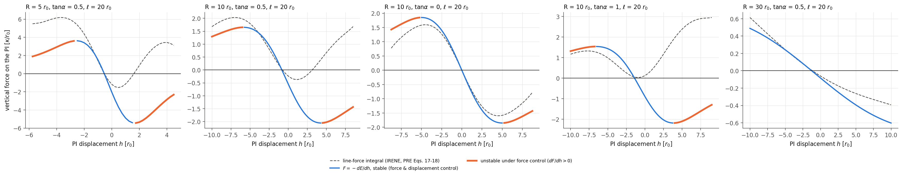

**R = 5 r0** (branch computed for -5.75 ≤ h ≤ 4.5; beyond, the membrane forms a steep neck and the Monge description
z(r) reaches its limit, see `figures/profiles_ring_R5_tan0.5.png`):

* **Displacement control: stable everywhere.** All eigenvalues are negative along the whole branch. The least stable
  mode is always axisymmetric (m = 0), with m = 1 close behind; both soften as |h| grows (λ_max from -1.87 at h = 0 to
  -0.18 at h = -5.75), but no eigenvalue crosses zero.
* **Force control: unstable beyond the force extrema.** F = -dE/dh has an extremum on each side: F = -5.44 at
  h ≈ +1.75 and F = +3.62 at h ≈ -2.5. For h > 1.75 and h < -2.5, dF/dh > 0: a PI held by a constant force cannot stay
  there and snaps (tube extrusion / retraction). This makes precise the remark of the PRE that "the presence of a
  maximum followed by a decrease may suggest the onset of instabilities": the instability exists under force control
  only, and it is set by the extremum of the *virtual-work* force, which is not where the line-force integral has its
  extremum.
* The zero-force (spontaneous) displacement is h ≈ -0.6.

**All ring sizes** (`results/summary.json`, `figures/force_displacement.png`, `figures/eigenvalues_vs_h.png`,
`figures/stability_summary.png`):

| R | computed h range | h at F = 0 | force extremum | unstable under force control | displacement control |
|---|---|---|---|---|---|
| 5 r0 | -5.75 … 4.5 | -0.55 | F = -5.44 at h = 1.75 | h > 1.75 and h < -2.6 | stable (max λ = -0.18) |
| 10 r0 | -10 … 8.5 | -0.83 | F = -2.06 at h = 4.25 | h > 4.4 and h < -5.9 | stable (max λ = -0.014) |
| 30 r0 | -10 … 10 | -1.25 | none within ±10 r0 | nowhere in this range | stable (max λ = -5.7e-4) |

* The force extremum, and with it the onset of the force-control (snap-through) instability, moves to larger |h| and
  smaller |F| as the domain size R grows; for R = 30 r0 it lies beyond h = ±10 r0.
* Under displacement control no instability is found for any R in the computed ranges; the least stable mode is always
  axisymmetric (m = 0), followed by m = 1, and the spectrum softens as |h| grows.
* The eigenvalues are real to 5e-4 (gradient flow), as expected.
* The line-force integral (dashed) disagrees with the virtual-work force wherever the deformation is large, and it
  places the extrema elsewhere (see Verification, point 2).

**Mesh convergence** (R = 5, tan α = 0.5, h_min 0.05 → 0.025, `results/checks/mesh_convergence_R5_tan0.5.csv`):
F(h) changes by ≤ 3e-4 and λ_max by ≤ 2.5e-3 for 0 ≤ h ≤ 4.25 (8e-3 at the end of the branch, h = 4.5); the force
extremum (h = 1.75, F = -5.442) is identical on both meshes.

**Contact angle** (R = 10, `figures/contact_angle_R10.png`):

| tan α | h at F = 0 | force-control unstable for | displacement control |
|---|---|---|---|
| 0 | 0 | \|h\| > 5.25 (symmetric) | stable |
| 0.5 | -0.83 | h > 4.5, h < -6.0 | stable |
| 1 | -1.39 | h > 4.0, h < -6.75 | stable |

A larger contact angle lowers the spontaneous (zero-force) height of the PI and moves the upward snap-through closer
(and the downward one further away).

Next steps: `PAPER_PLAN.md`.

### Stability diagram in the (h, α) plane and PRE Fig. 5 in physical units (`plot_flow_v2.py`)

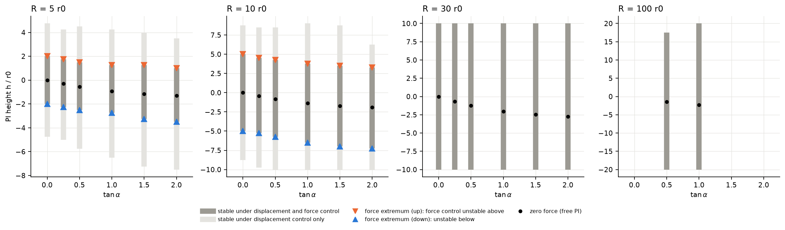

Sweeps for tan α = 0, 0.25, 0.5, 1, 1.5, 2 and R = 5, 10, 30 r0 (R = 100: tan α = 0.5, 1; `results/flow2_summary.json`,
key `ring_diagram`):

* **Displacement control: stable everywhere** in the computed ranges (all R, all α). The least stable mode is
  axisymmetric (m = 0), except near the end of the branches for R = 5 and tan α ≥ 1.5, where the tilt mode (m = 1)
  becomes the least stable one — still with λ < 0. No non-axisymmetric instability was found.
* **Force control: unstable beyond the force extrema** (Schur complement: force-control stable ⇔ displacement-control
  stable and dF/dh < 0; the extremum of the mesh-converged virtual-work force F = −dE/dh is the snap-through point).
  Heights of the extrema (up / down), in r0:

| tan α | R = 5 | R = 10 | R = 30, 100 |
|---|---|---|---|
| 0 | 2.0 / −2.0 | 5.0 / −5.0 | beyond ±10 (±20) |
| 0.25 | – | 4.5 / −5.25 | beyond |
| 0.5 | 1.5 / −2.5 | 4.25 / −5.75 | beyond |
| 1 | 1.25 / −2.75 | 3.75 / −6.5 | beyond |
| 1.5 | 1.25 / −3.25 | 3.5 / −7.0 | beyond |
| 2 | 1.0 / −3.5 | 3.25 / −7.25 | beyond |

  A larger contact angle moves the upward snap-through closer and the downward one further away; the zero-force height
  of a free PI goes from 0 (tan α = 0) to −1.3 (R = 5), −1.9 (R = 10), −2.7 r0 (R = 30) at tan α = 2.
* An explicit force-control eigenproblem (h as an extra unknown, rim degrees of freedom tied) cannot be built from
  IRENE's ring residual as it is: its rim rows keep the boundary term of the bending flux and use the normal force per
  unit area (× √g), so their sum is not the vertical force on the PI — the same issue as the line-force integral
  (to discuss with M. Castellana together with the force definition).

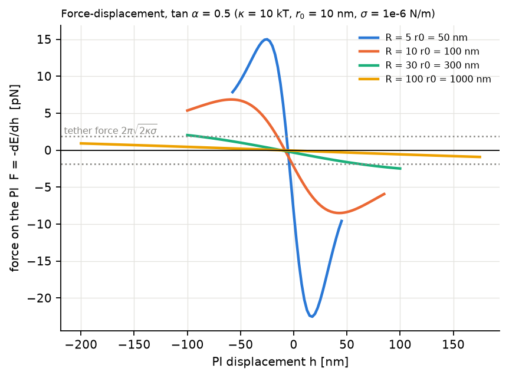

In physical units (r0 = 10 nm, κ = 10 kT, σ = 0.0025 κ/r0² = 1e-6 N/m; force unit κ/r0 = 4.1 pN): the force
extrema are 22 pN / 15 pN (R = 50 nm) and 8.5 / 6.8 pN (R = 100 nm), above the tether-extrusion force
2π√(2κσ) = 1.8 pN; over the computed range the force stays below 2.5 pN for R = 300 nm (|h| ≤ 100 nm) and below
0.93 pN for R = 1 µm (|h| ≤ 200 nm), where no extremum is reached yet.

## Force on the PI against exact solutions (`check_force_exact.py`)

| test | error of F = -dE/dh, coarse → fine mesh | error of the line-force integral, coarse → fine mesh |
|---|---|---|
| small deformations (exact linear theory, 4 cases) | 7e-5 … 6e-4 → 3e-5 … 1.6e-4 | 1 % … 4 % → 4 % … 13 % |
| catenoid (H = 0, exact for any σ), σ = 1 | 3e-5 … 8e-5 → 2e-6 … 4e-5 | 0.2 % … 1.5 % → 2 % … 3 % |
| catenoid, σ = 0.0025 (tension force tiny vs bending) | 8 % → 1.7 % | 280 % → 1000 % |

The virtual-work force converges to the exact solutions; the line-force integral does not converge under mesh
refinement, even for the catenoid where the moment term vanishes identically (discretization of ∂μ/∂n on a boundary
where μ = H is imposed weakly). Results: `results/checks/check_force_exact_*.log`.

## Stage 3: flow-driven instabilities (`irene_addon/stability/flow`)

Figures: `figures/flow_*.png` (made by `plot_flow_results.py`). Units: lengths r0, energies κ, velocities κ/(η r0)
(PRE setup), rates κ/(ζ r0⁴).

### Tool and verification

* `flow_problem.py`: IRENE's steady flow problem (fields v, w, σ, z, ω, μ; square with a PI, inflow v0) with the mass form
  ρ⟨v,ν_v⟩ + ρ⟨w,ν_w⟩ + ⟨z,ν_z⟩ read off IRENE's time-dependent equations (1)-(4), and
  - parameter overrides (`STABILITY_PARAMS="rho=0,eta=1,zeta=1,..."`, applied before IRENE's forms are built);
  - an optional **normal friction** ζw (drag of the surrounding solvent, not in IRENE): ρ D_t w = f_n - ζw. IRENE's model
    has no dissipation of the normal motion of a flat membrane, so the ρ → 0 limit (lipid membranes: Re ~ 1e-9) is only
    well posed with ζ > 0. Flat / static steady states and the location of real (divergence) thresholds do not depend on ζ;
  - `square_a` (IRENE example: PI height fixed, slip on the PI via penalty) and `square_b` (the setup of the PRE: no slip
    on the PI, fixed contact angle ∇z = t r̂ and free height of the PI, flat outer boundary);
  - dissipative boundary terms (see below) and `exact_walls=1` (v² = 0 on the walls as a Dirichlet BC instead of IRENE's
    penalty).
* **Membrane at rest, inertial model** (`check_flow_at_rest.py`): undamped bending waves λ = ±i√(Λ/ρ) with Λ from the
  independent no-flow residual: |Re λ|/|Im λ| ≈ 1e-12, frequency difference 4.9 % → 1.5 % under mesh refinement.
* **Membrane at rest, overdamped model** (`check_friction_at_rest.py`): with ρ = 0 and friction ζ the same modes relax with
  λ = -Λ/ζ; agreement 1e-9 for ζ = 1 and 3 (`results/checks/friction_at_rest`).
* **Boundary conditions for the dynamics.** IRENE's flow residual subtracts the viscous traction on the walls, on the PI
  and (y component) at the outflow: the tangential velocity has no BC there. The steady solver does not mind, but the
  linearized dynamics then has spurious growing in-plane modes at the boundaries even at rest (λ ≈ +34 … +105). The
  analysis adds these terms back (free slip on walls and PI, traction-free outflow). **To discuss with M. Castellana.**
* **Time-dependent cross-check** (`flow_time_check.py`): IRENE's full nonlinear equations m(∂t ψ) + F(ψ) = 0 integrated
  with BDF2 from the steady state + 1e-3 × leading eigenvector. PRE setup (t = 0, mesh A): growth rate at SL = 20
  +5.5795e-6 vs eigenvalue +5.5788e-6, decay rate at SL = 12 -6.9208e-6 vs -6.9199e-6 (relative error 1.3e-4, the
  BDF2 time error). 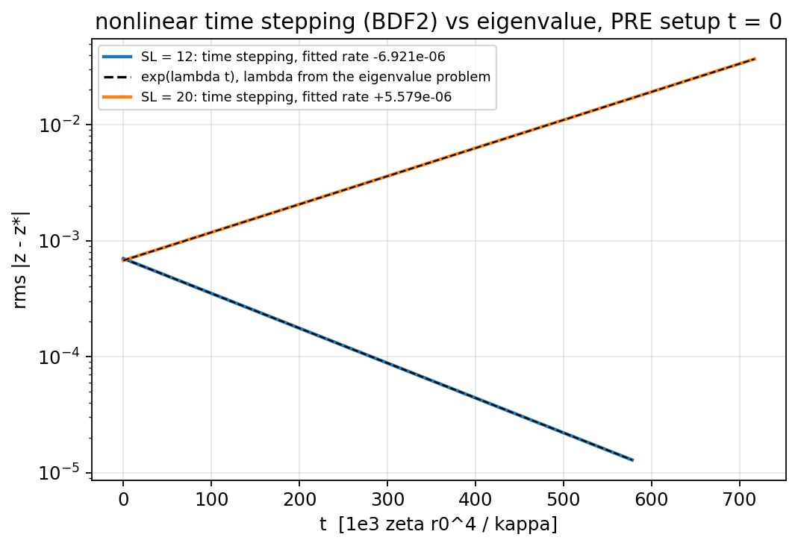
* Threshold search (`flow_critical.py`): continuation in v0 (adaptive steps), eigenvalues closest to 0, bisection on the
  sign of the leading real eigenvalue (relative tolerance 1e-3).

### Result 2: flow-driven buckling of a membrane around a protein inclusion (PRE setup)

> **Superseded.** The thresholds in this section use IRENE's square_b PI condition, which leaves the PI height free
> but imposes no vertical force balance on it; with physical PI conditions the threshold is SL_c = 27.4, not 16.2, and
> the bifurcation is subcritical. See **"Result 2, corrected"** below. The time-stepping check and the verification
> remain valid (they test the solver on the same equations).

Geometry and parameters of Ferraro & Castellana, PRE (Figs. 9-11): square L = 100 r0 with the PI at its centre, uniform
inflow v0 on the left, σ = σ0 = 0.0025 κ/r0² at the outflow (ℓ = √(κ/σ0) = 20 r0, i.e. Table I), no slip on the PI,
slip walls, z = 0 and flat on the square, ρ = 0 (overdamped, friction ζ). SL = η v0 L/κ (the PRE's v* = κ/(Lη) is SL = 1).
Graded meshes (`generate_mesh/2d/square_graded`): A (h 0.15 at the PI … 3), B (0.1 … 2), C (0.07 … 1.4).

* **Zero contact angle (t = 0): a genuine instability.** The base state is flat for all v0. The slowest mode relaxes more
  and more slowly as the flow increases and its eigenvalue crosses zero (real, stationary bifurcation) at

  | mesh | A | B | C |
  |---|---|---|---|
  | SL_c | 16.524 | 16.279 | 16.168 |

  (converging at about second order; Richardson extrapolation SL_c ≈ 16.1), i.e. v_c ≈ 16 v* ≈ 0.16 κ/(η r0). Insensitive to the penalty α (α = 100 vs 1000: 16.524 vs 16.528) and to the wall BC
  (penalty vs exact: 2e-5).
  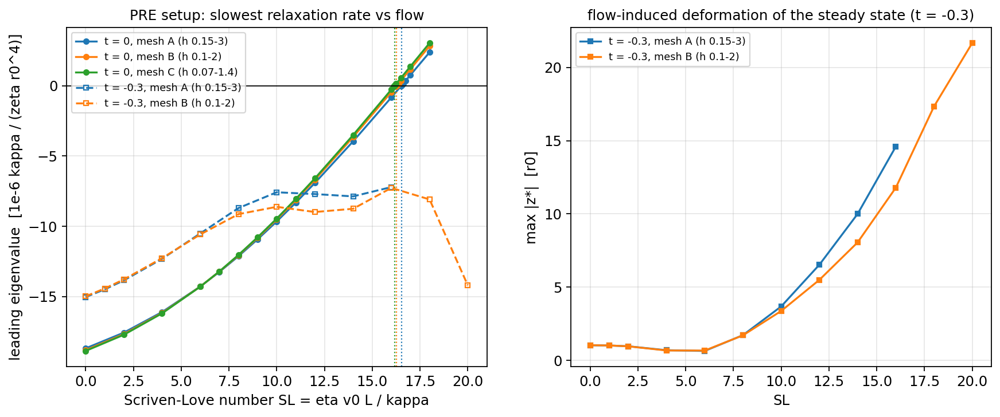
* **Mechanism: the drag on the PI compresses the membrane upstream.** The PI (no slip) is an obstacle; the force it
  exerts on the flowing membrane is carried by a gradient of tension, which *drops upstream* of the PI. At SL_c the
  tension at the inflow is σ ≈ -0.0064 (vs σ0 = +0.0025 at the outflow): about half of the membrane is under
  compression, and the unstable mode is a dome centred on the PI (the PI moves out of plane) — Euler buckling of the
  membrane patch driven by viscous drag. It exists at ρ = 0: inertia plays no role.
  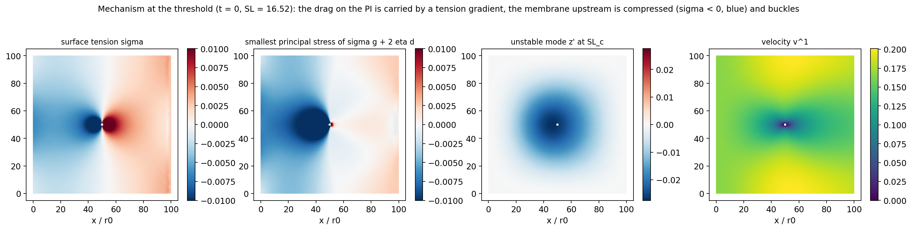
* **Threshold vs tension** (mesh A, Γ = σ0 L²/κ = 0, 10, 25, 50, 100): SL_c = 12.02, 13.85, 16.52, 20.89, 29.41, i.e.
  SL_c ≈ 12.1 + 0.174 Γ (linear fit), or v_c ≈ 12 κ/(ηL) + 0.17 σ0 L/η: bending sets the threshold for small domains/tensions, the
  tension for large ones. 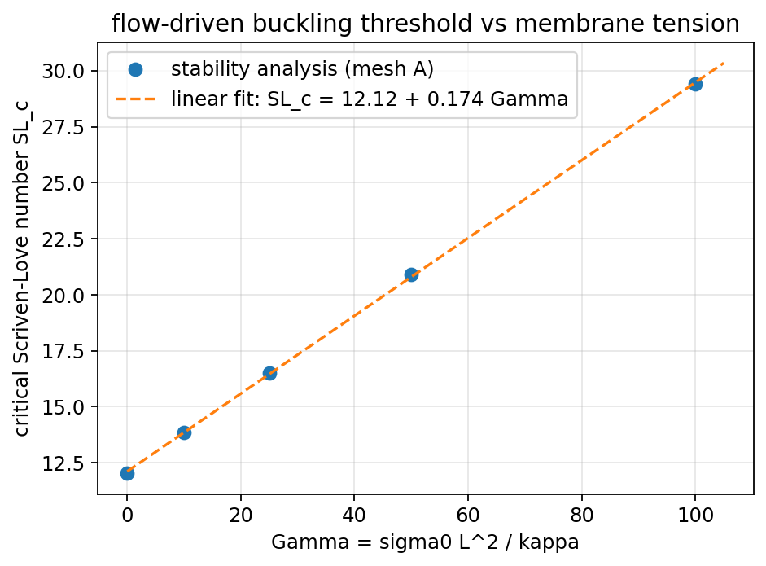
* **Nonzero contact angle (t = -0.3, as in the PRE): imperfect bifurcation.** The contact angle breaks the up-down symmetry
  and unfolds the pitchfork: there is no sharp threshold, but the steady deformation grows steeply around SL ≈ 8-18
  (max|z*| = 1 at rest, 0.64 at SL = 6, 3.7 at SL = 10, 14.6 at SL = 16, 21.7 at SL = 20, mesh B) and has the shape of
  the buckling mode; the slowest relaxation rate dips near SL_c (-1.5e-5 → -7.3e-6 at SL = 16) and recovers on the
  deformed branch (Re λ = -1.4e-5 at SL = 20, now a damped complex pair): the deformed state is stable. This identifies the **flow-induced deformation
  that the PRE reports above v* (Fig. 11B) as the imperfect form of a buckling instability**, with its sharp threshold
  SL_c recovered for t → 0. 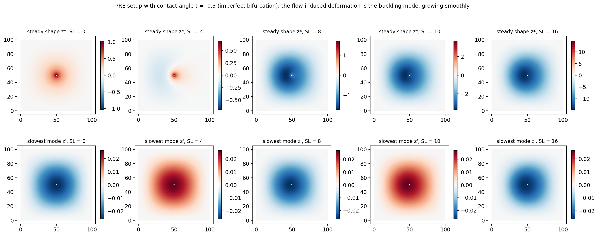
* Physical units (κ = 10 kT, η = 1e-8 Pa m s, L = 1 µm, σ0 = 1e-6 N/m): v* ≈ 4.1 µm/s, v_c ≈ 16 v* ≈ 67 µm/s.
* Caveats: the threshold depends on the domain (fixed-height square boundary, slip walls, L): in an unbounded membrane
  the 2D Stokes paradox makes the tension drop grow logarithmically with the size, and the surrounding fluid (Saffman-
  Delbrück length) cuts it off; the result should be restated in terms of the physical cut-off. The Monge gauge limits
  the post-buckling branch (continuation stops at max|z*| ≈ 20 r0).

### Result 2, corrected: flow-driven buckling with physical PI conditions (`results/flow2/`)

**The PI condition of IRENE's square_b.** z is free on the PI rim, but the rim rows of IRENE's normal force balance
keep the boundary term 2κ n·∇μ of the integration by parts (and the tension and viscous terms are not integrated by
parts), so nothing imposes zero net vertical force on the PI. In the critical mode the PI carries a net vertical force
(∮2κ∂μ'/∂n = 1.9e-4 in the mode's normalization); the work of this force on the PI displacement, −5.1e-6, is exactly
the rim term of IRENE's equation (ratio 0.995) and makes the membrane buckle too early (`check_pi_force.py`,
`results/checks/pi_force_meshA`). Two physical conditions were added to `flow_problem.py`: `pi_height = 1` (PI clamped
in height) and `pi_height = 2` (rigid PI of free height: z' and w' tied on the rim, zero net vertical force; for flat
base states). **To be discussed with M. Castellana: it also affects the PRE's deformations with flow.**

**Compressed-plate model (exact reduction).** For a PI with zero contact angle the base state is flat for every v0 and
the in-plane stress T = σ g + 2η d is linear in v0 (T = σ0 I + v0 T1, 2D Stokes flow). Normal and in-plane
perturbations decouple, and a perturbation z' obeys ζ ∂z'/∂t = −κΔ²z' + T:∇∇z' = −κΔ²z' + ∇·(T∇z') (∇·T = 0): a plate
under the flow-induced stress, self-adjoint; the threshold is a generalized eigenvalue problem for v0
(`flow_plate_model.py`, mixed P2×P2). It reproduces the full IRENE equations with physical PI conditions to 0.1–0.4 %
for every geometry below.

| threshold SL_c (Γ = 25, L = 100) | mesh A | mesh B | mesh C | plate model (C) |
|---|---|---|---|---|
| rigid force-free PI | 27.504 | 27.465 | 27.449 | 27.432 |
| clamped PI | 27.732 | 27.682 | 27.664 | 27.644 |
| IRENE's square_b PI (no force balance) | 16.524 | 16.279 | 16.168 | – |

v_c = SL_c κ/(ηL) ≈ 27.4 v* ≈ 110 µm/s in the units of the PRE (κ = 10 kT, η = 1e-8 Pa m s, L = 1 µm).

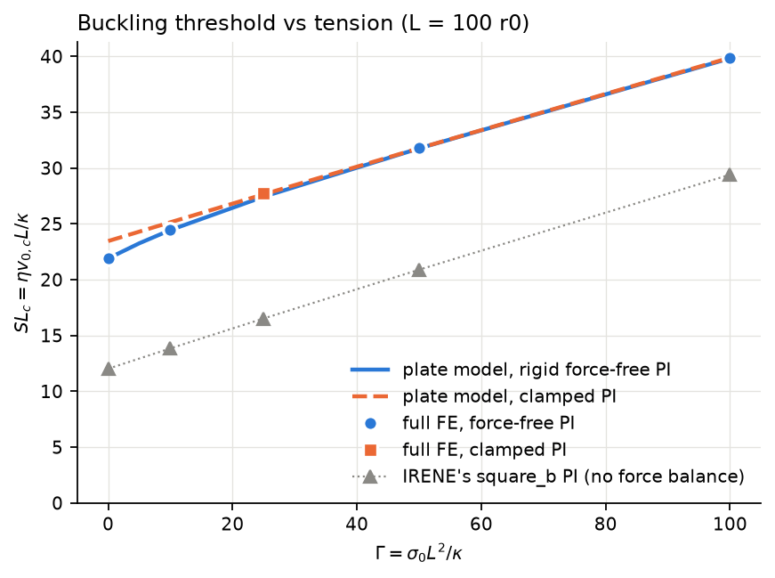

**Tension** (mesh C, force-free PI; plate model in brackets): SL_c = 21.91 (21.90), 24.46 (24.44), 27.45 (27.43),
31.78 (31.76), 39.85 (39.82) for Γ = σ0L²/κ = 0, 10, 25, 50, 100: no longer linear in Γ.

**Mechanism** (`figures/flow2_plate_model.png`). The energy balance of the critical mode (per unit bending energy) is
dominated by the flow-induced *tension drop* σ1 upstream of the PI (−0.87 at Γ = 0, −0.95 at Γ = 25); the viscous
stress 2ηd adds −0.13 … −0.25 and the base tension +0 … +0.2. The critical mode is a dome **upstream** of the PI
(centred ≈ 20 r0 upstream, between the PI and the inflow boundary); its azimuthal content around the PI is
m = 0 : 1 : 2 = 1 : 0.36 : 0.08 at Γ = 25 (the m = 1 part grows with Γ: 0.11 at Γ = 0, 0.88 at Γ = 100).

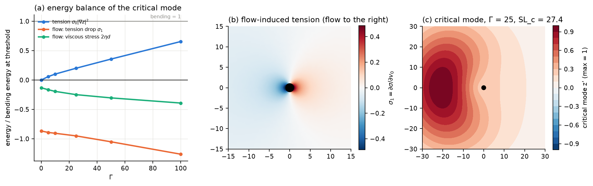

**Domain and boundaries** (`figures/flow2_domain.png`, full FE with force-free PI; plate model agrees to ≤ 0.4 %):

| case (Γ = 25 unless noted) | SL_c |
|---|---|
| L = 50 / 100 / 200 r0 (fixed Γ) | 22.75 / 27.50 / 32.43 |
| r0 = 2 / 1 / 0.5 at L = 100 (same L/r0 as above) | 22.75 / 27.50 / 32.43 |
| L = 50 / 100 / 200 at fixed σ0 = 0.0025 (Γ = 6.25, 25, 100) | 19.51 / 27.50 / 47.51 |
| width W = 50 / 100 / 200 (L = 100) | 21.86 / 27.50 / 31.44 |
| free walls (z free on top/bottom) | 26.85 |
| only the inflow edge held (walls and outflow free) | 12.12 |

* At fixed Γ the threshold depends only on L/r0, logarithmically (+4.8 per doubling of L/r0): the drag of the PI and
  the tension drop are those of 2D Stokes flow (Stokes paradox).
* The threshold is **set by the geometry** — box size, width and above all how the outer boundary is held (a factor
  2.3 between the clamped square and a membrane held only at the inflow edge). The result must be stated for a given
  geometry, or with a physical cut-off:

**In-plane friction with the surrounding fluid** (b (v − v0 e_x), screening length ℓ_b = √(η/b), σ0 = 0.0025,
`figures/flow2_friction.png`): friction *lowers* the threshold (v_c = 0.275 → 0.259, 0.244, 0.200, 0.118 κ/(ηr0) for
ℓ_b = ∞, 20, 10, 5, 2 at L = 100) and does **not** remove the box dependence (L = 200: 0.238 → 0.086). Reason: in a
Brinkman membrane the tension (pressure) disturbance is harmonic and not screened (∇·T = b v' only acts on v), while the
drag of the PI, which sets its amplitude, grows as ℓ_b decreases. With friction ∇·T ≠ 0 and the normal-force term
(∇·T)·∇z' is non-conservative (a follower load): for ℓ_b = 5–10 the first instability is **oscillatory (Hopf,
flutter)**, Im λ ≈ 1e-5, found by the full FE below the divergence threshold of the plate model; for ℓ_b = 2 and 20 it
is a divergence (plate model and full FE agree to 0.1 %).

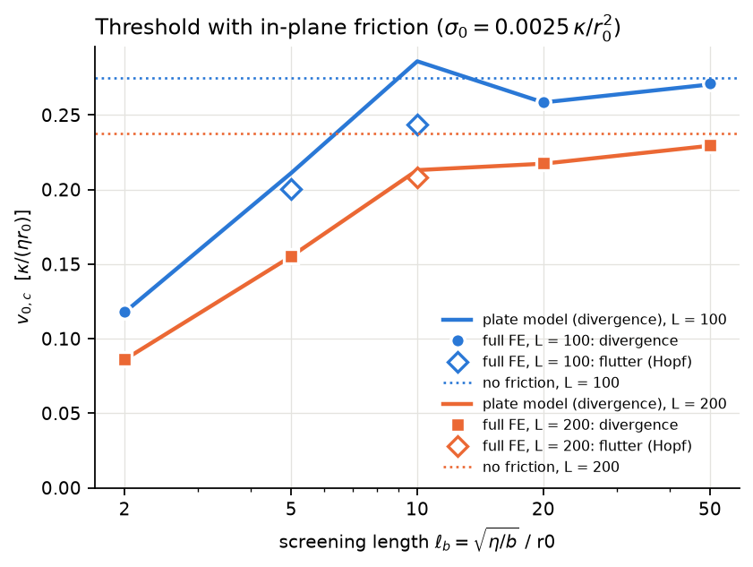

**Bifurcation diagram** (clamped PI, mesh A, `flow_branch.py`, `figures/flow2_bifurcation.png`). The pitchfork is
**subcritical**: the buckled branch of the perfect problem bends back, v0/v0_c = 1 − 0.0018 A² (A ≈ max z / r0), down
to 0.56 v0_c at A = 20 r0, and is unstable all the way (no stable large-amplitude state within the Monge description).
With a contact angle t ≠ 0 the steady branch has a **fold before v0_c** (λ → 0), beyond which no nearby steady state
exists: the membrane snaps to a large deformation (hysteresis). The fold moves as 1 − v_fold/v0_c = 0.011, 0.022,
0.048, 0.092 for |t| = 0.01, 0.03, 0.1, 0.3 — exponent 0.63, Koiter's 2/3 law of imperfection sensitivity. The PRE's
"flow-induced deformation above v*" (t = −0.3) therefore ends in a snap-through at ≈ 0.91 v0_c.

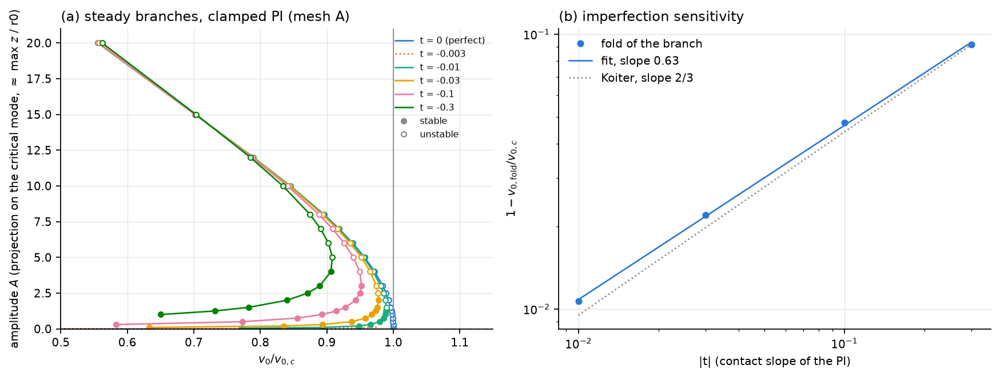

**Adjoint sensitivity** (clamped PI, mesh A, `flow_sensitivity.py`, `figures/flow2_sensitivity.png`). The adjoint
z-mode equals the direct one (cosine 0.99999, as the plate reduction predicts: the normal problem is self-adjoint at a
flat base state); the wavemaker is the upstream dome. The sensitivity of the threshold to a steady in-plane point force
(Marquet-Sipp-Jacquin, via the adjoint of the base-flow Jacobian; checked against a direct computation to 2e-7) is
largest in a band 5–15 r0 upstream of the PI across the channel (|∂v0_c/∂f| ≤ 0.21 per unit point force); a force along the flow
raises the threshold (it relieves the compression), a force against it lowers it.

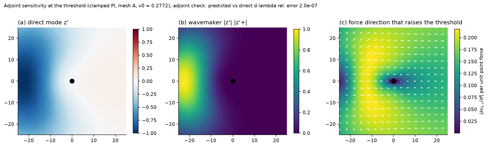

### IRENE's example setup (square_a, κ = ρ = η = σ = 1, L = 1, r = 0.25)

* Two mechanisms: (i) inertial, as for a pipe conveying fluid — the two lowest bending waves (ω = 203 at rest) slow down,
  collide at ω = 0 and become a real pair ±s (divergence, `figures/flow_irene_example_collision.png`);
  (ii) viscous (as above): present even at ρ = 0.
* **The thresholds of this setup are not quantitative**: slip on the curved PI is imposed by IRENE's penalty
  (α/h)⟨n·v n·ν⟩, whose strength does not scale with η, and the threshold depends on it (ρ = η = 1: v0_c = 8.92, 6.60, 5.91
  for α = 100, 1e3, 1e4; ρ = 0, η = 1: SL_c = 11.5, 7.7, 6.7), and on the mesh (8.92, 9.37, 9.70 for h = 0.03, 0.018,
  0.012 at α = 100, where refinement also strengthens the penalty). A Nitsche formulation of the slip condition would be
  needed; the PRE setup (no slip on the PI) does not have this problem.
* The weak growth of the bending waves at small v0 (Re λ ≈ 1e-2, |Im λ| ≈ 200) is **numerical**: at v0 = 8 it goes
  0.143 → 0.033 → 0.0099 for h = 0.03 → 0.018 → 0.012 (≈ h³ → 0). 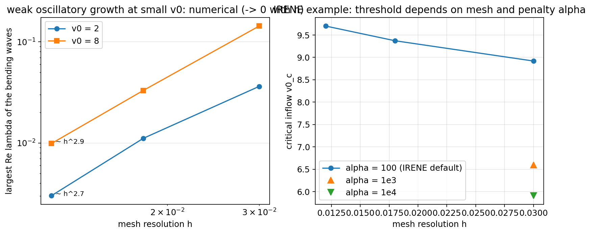

## Round 3 (`results/round3/`, `figures/r3_*.png`, `figures/gifs/gif5–7`)

Weakly nonlinear theory (`flow_landau.py`), post-snap time stepping (`flow_snap.py`), the force-free PI with a contact
angle (`flow_forcefree.py`, `modules/stability/vertical_force.py`), the standalone flat-membrane model (`plate/`:
periodic cells, Bloch waves, several PIs, flutter map, wrinkles, local and mobile-protein analyses), the axisymmetric
tube solver (`axisymmetric/`). Results and their interpretation: `INTERPRETATION.md` Part II; physical tables:
`results/round3/physical_tables.md`; status and what is left: `ROUND3_STATUS.md`. Figures: `plot_round3.py`;
animations: `make_gifs_round3.py`; collection of runs: `collect_round3.sh`.

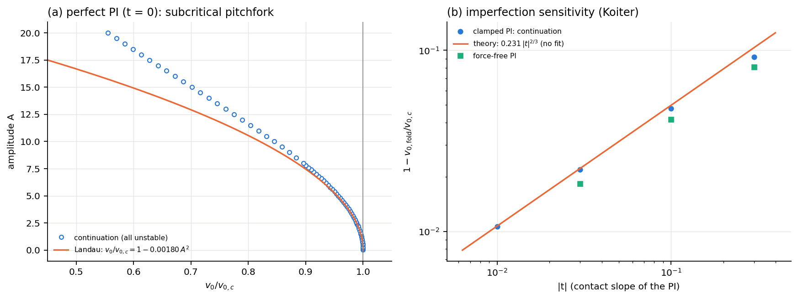
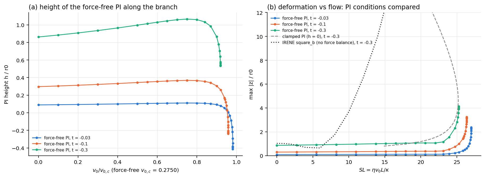
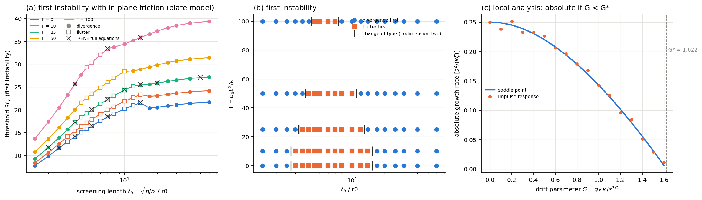
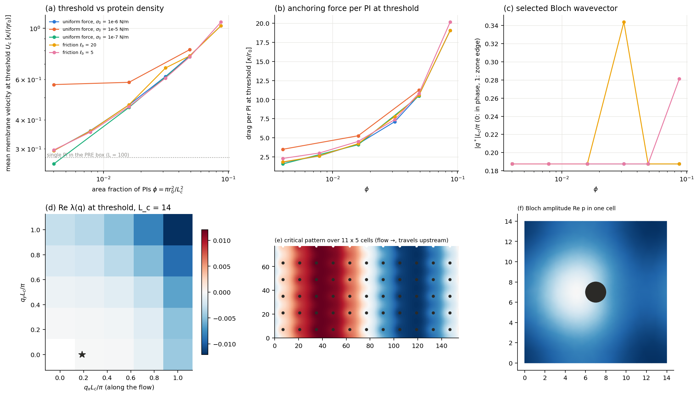
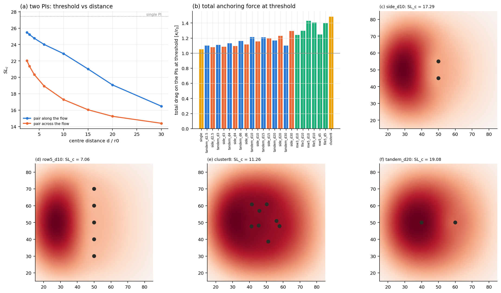
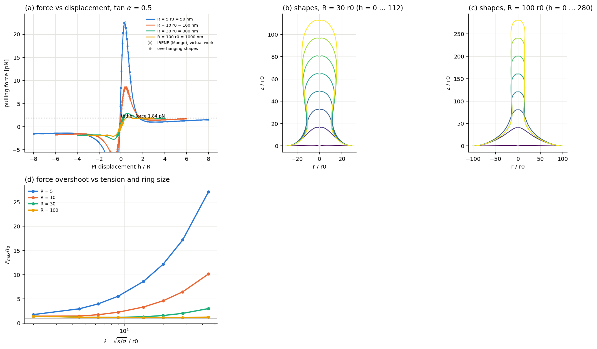

## Round 4 (`results/round4/`, `figures/r4_*.png`)

- **Post-snap with a force-free PI** (`irene_addon/stability/flow/flow_snap_ff.py`).
  - Time stepping beyond the fold (t = −0.3, 0.93 and 0.97 v0_c), with the PI height fixed by zero vertical force at
    every step.
  - The PI is lifted (h: 0.7 → 7–8 r0) while the pit upstream deepens to −16.5 r0.
  - The wall between them passes slope 12: an S-shaped fold, the onset of an overhang beyond the Monge gauge.
- **Nonlinear lattice coefficient** (`plate/nonlinear_cell.py`).
  - Homogenized cell problem for a tilted lattice of rigid, force-free, horizontal PIs, using IRENE's nonlinear normal
    force balance with the base flow frozen.
  - It gives J(u) = σ_eff u + g u³ of the long-wave slope equation ζH_t = ∂x J(H_x) − K_eff H_xxxx − ζcH_x.
  - At the threshold drive, g < 0 for φ ≤ 5 % (subcritical, collapse) and g > 0 for φ = 9 % (slope saturation at
    |u| ≈ 0.1: terraces).
  - Validated at rest against the energy and the Bloch σ_eff.
- **Mobile curvature proteins in IRENE** (`irene_addon/stability/flow_phi/`).
  - Two extra fields: the protein density φ and its chemical potential m.
  - The proteins have spontaneous curvature C0 = 2Cφ, are advected by IRENE's flow, diffuse (Cahn–Hilliard), and feed
    back on the normal force and through −φ∇m on the flow.
  - Linear stability of the flat state around the anchored PI: protein threshold χ_c against the flow, and buckling
    threshold against χ.

Interpretation: `INTERPRETATION.md` Part III; status: `ROUND4_STATUS.md`.

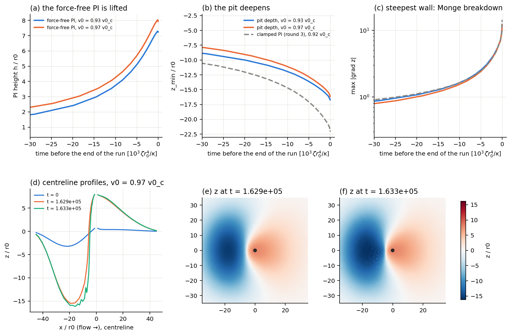
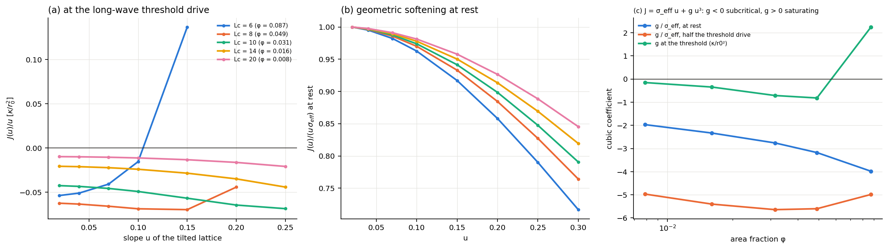
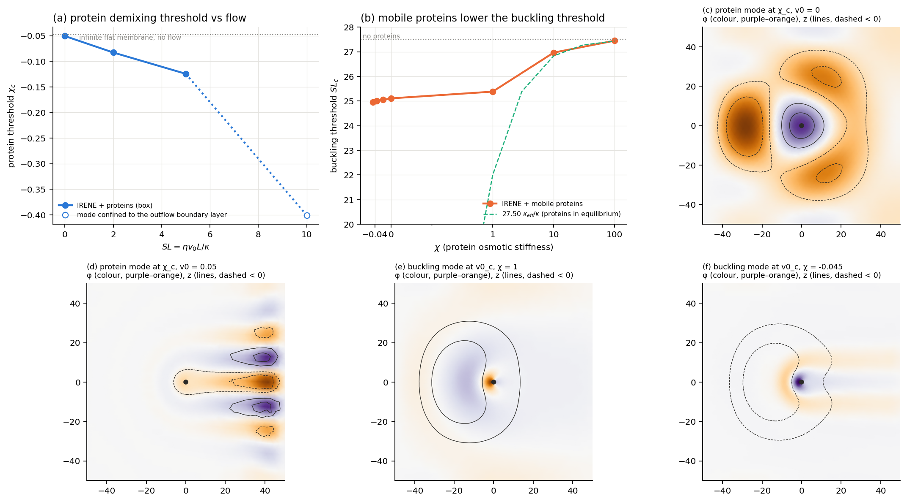

## Round 5 (`results/round5/`, `figures/r5_*.png`, `figures/gifs/gif8–12`)

- **Nonlinear flutter** (`irene_addon/stability/flow/flow_flutter.py`).
  - IRENE's full equations with in-plane friction (ℓ_b = 7 r0, Γ = 25) and a force-free PI, just above the flutter
    threshold.
  - The Hopf bifurcation is **supercritical**: limit cycles with amplitude 3.9 / 6.5 / ≈ 11 r0 at 1.05 / 1.10 /
    1.20 v0_c.
  - The PI bobs up and down and emits waves that travel upstream.
  - Linear growth and decay rates agree with the eigenvalues; a kick below threshold decays.
- **Slope equation of protein lattices** (`plate/slope_equation.py`), with every coefficient from the full model:
  - terraces (supercritical) at φ = 8.7 %;
  - steep terraces with hysteresis (subcritical) at φ = 4.9 %;
  - collapse at φ ≤ 1.6 %;
  - the drift makes the lattice instability **convective** up to ε_a ≈ 0.94–1.18 (drifting Kuramoto–Sivashinsky
    pinch point C_a = 1.622). A finite patch needs about twice the periodic threshold drive.
- **Proteins and flow** (`irene_addon/stability/flow_phi/`):
  - consistent nonlinear protein forms (same linearization), a free-outflow sponge, a quartic saturation;
  - nonlinear time stepping `phi_dynamics.py`, with the free energy decreasing at rest;
  - 3D animations: demixing at rest, stripes along the flow, a protein wake from a source at the PI;
  - Péclet sweep (absorbing outflow):
    - at M = 1 the flow flushes the proteins and suppresses demixing;
    - at M ≥ 100 demixing and buckling merge (SL_c down to 3);
    - at M ≈ 10 the critical modes travel.
- **Tricritical density of protein lattices:** φ* ≈ 0.075 (`figures/r5_tricritical.png`).
- **Beyond the Monge gauge** (`irene_addon/stability/parametric/`).
  - IRENE's forms on a parametric surface X(u, t), with the frame E = ∇X as a mixed variable (IRENE's geometry module
    is gauge-generic). A quasi-Monge ALE gauge reproduces the Monge run (pit depth within 1 %).
  - It follows the post-snap fold **through the vertical into an overhang** (n_z < 0), with the force-free PI on the
    crest.

Interpretation: `INTERPRETATION.md` Part IV; status: `ROUND5_STATUS.md`.

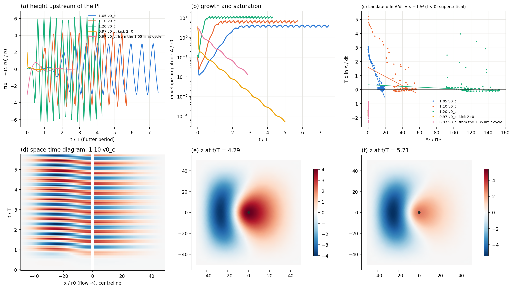
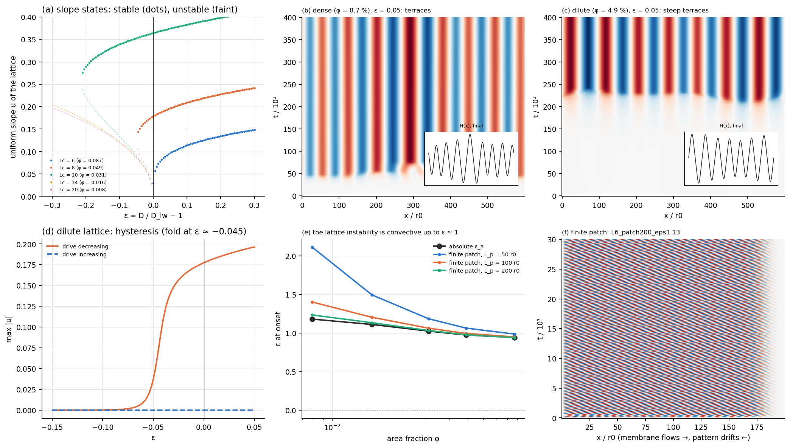
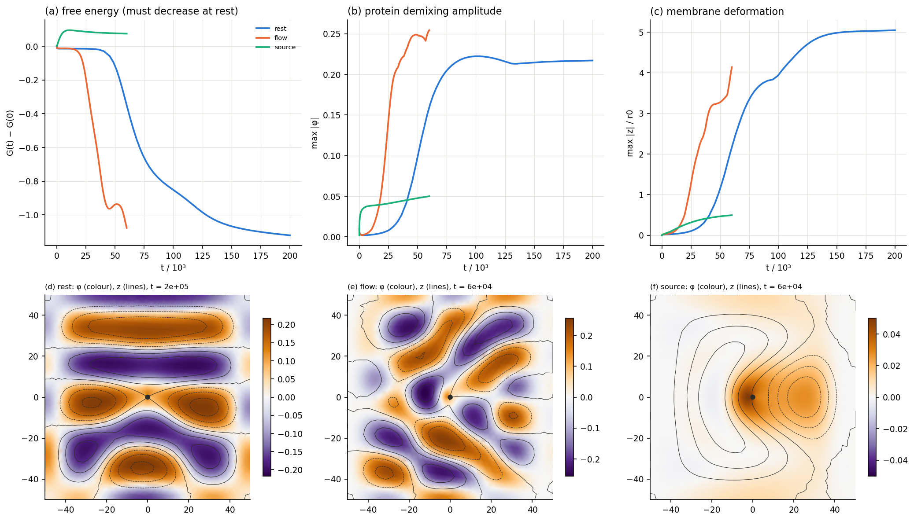
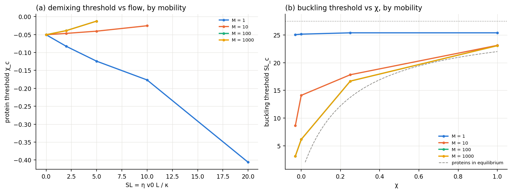
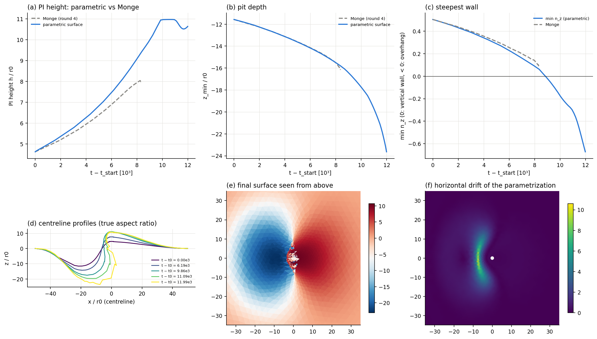
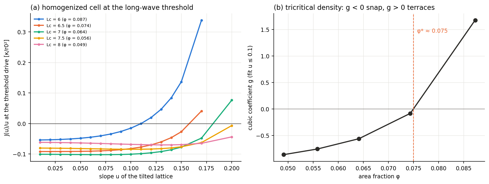

## Round 6 (`results/round6/`, `figures/r6_*.png`)

- **Protein wake as an imperfection of the snap** (`irene_addon/stability/flow_phi/imperfection.py`).
  - Weakly nonlinear reduction with the protein fields: λ_v, the cubic coefficient a, and the projection H_Q of a
    protein source at the PI rim.
  - The snap persists, and the fold moves as Koiter's Q^(2/3):

    | Q | continuation | theory |
    |---|---|---|
    | 0.01 | 0.037 | 0.036 |
    | 0.03 | 0.082 | 0.075 |
    | 0.1 | 0.204 | 0.167 |

  - Mobile proteins make the snap 65 % more subcritical (M = 1, χ = −0.05).
- **2D slope equation of protein lattices** (`plate/lattice_transverse.py`, `plate/nonlinear_cell.py --angle`,
  `plate/slope_equation_2d.py`).
  - Anisotropic coefficients from the Bloch spectrum and from tilted cells:
    - σ(θ) = σ_xx cos²θ + σ_yy sin²θ;
    - the flow softens only σ_xx;
    - σ_yy = 0.677 at threshold for φ = 8.7 %.
  - Terraces form as straight stripes across the flow, stable against zigzag (D_yy > 0).
  - Lateral invasion front at 0.089 r0 per unit time, against 0.084 from linear spreading.
- **Codimension-two point of buckling and the travelling protein mode** (M = 10;
  `irene_addon/stability/flow_phi/codim2.py`).
  - The eigenvalue map shows the static window closing and merging into the travelling mode near χ ≈ 0.06–0.09,
    SL ≈ 18–20 (a degenerate Bogdanov–Takens point).
  - Centre-manifold coefficients:
    - static branch subcritical (a = +7.2e-8 / +6.2e-8 at χ = 0.1 / 0.075);
    - Hopf branch subcritical (Re d = +1.5e-6 at χ = 0 and 0.05);
    - b < 0 and a ≈ 0 at the merger.
  - Time stepping confirms runaway in both sectors (3D animations `figures/gifs/gif13–14`, `make_gifs_round6.py`).
- **Towards a tube** (`irene_addon/stability/parametric/param_remesh.py`, `remesh_gmsh.py`, `tube_driver.sh`).
  - Remeshing and reparametrization tools, plus a Newton-solver reset after failures.
  - The round-5 overhang could not be continued further (see `INTERPRETATION.md` §27 for the diagnosis and what is
    needed).

Interpretation: `INTERPRETATION.md` Part V; status: `ROUND6_STATUS.md`.

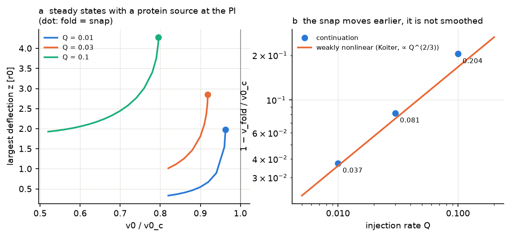
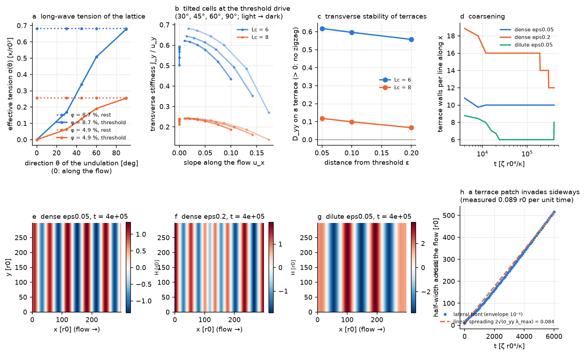
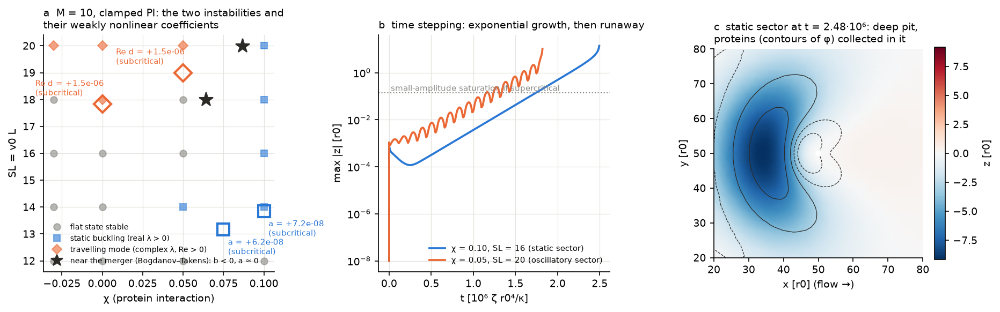
